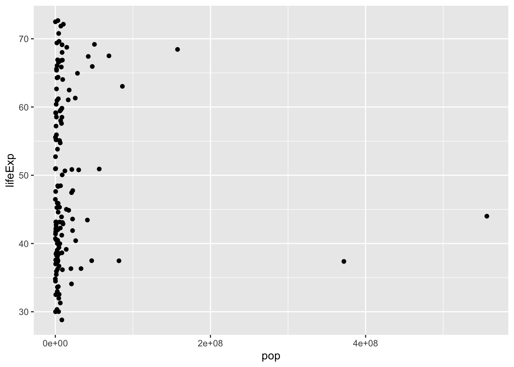
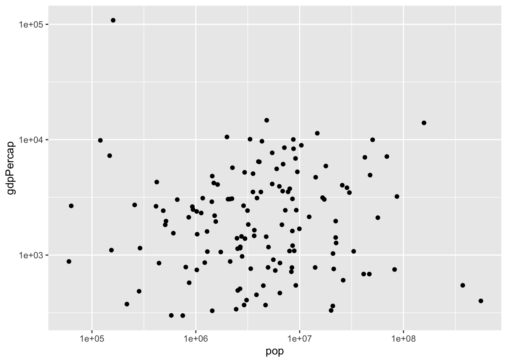
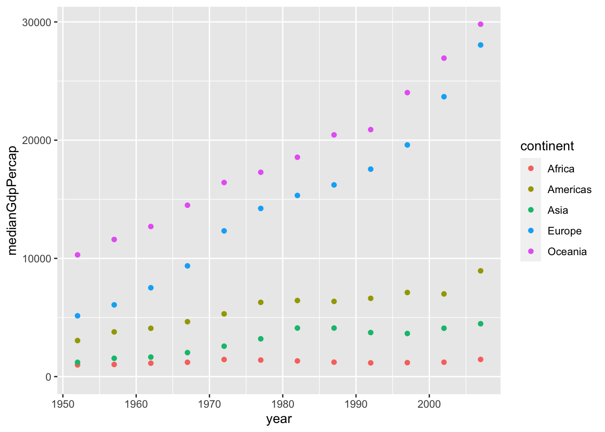
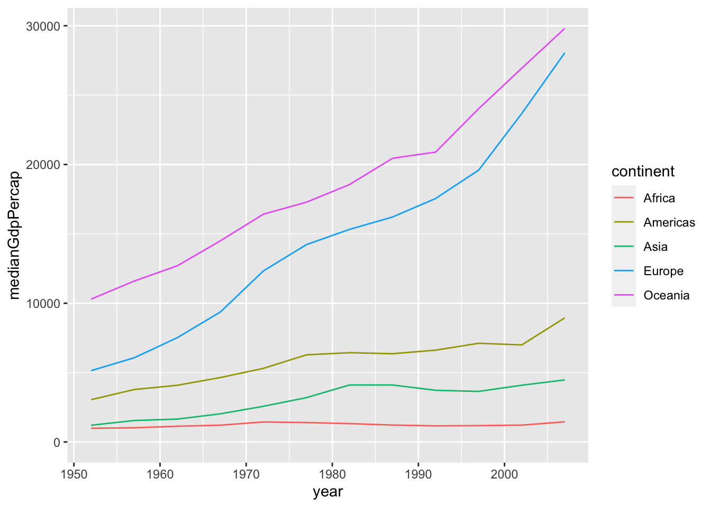
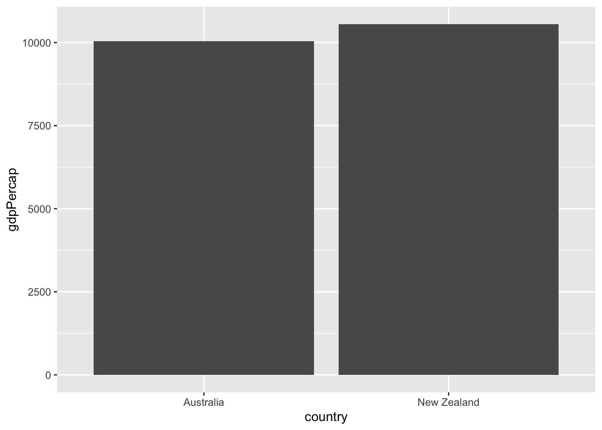
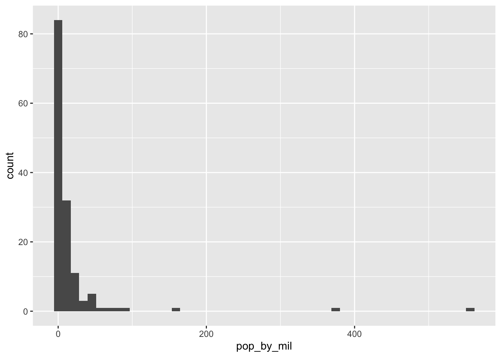
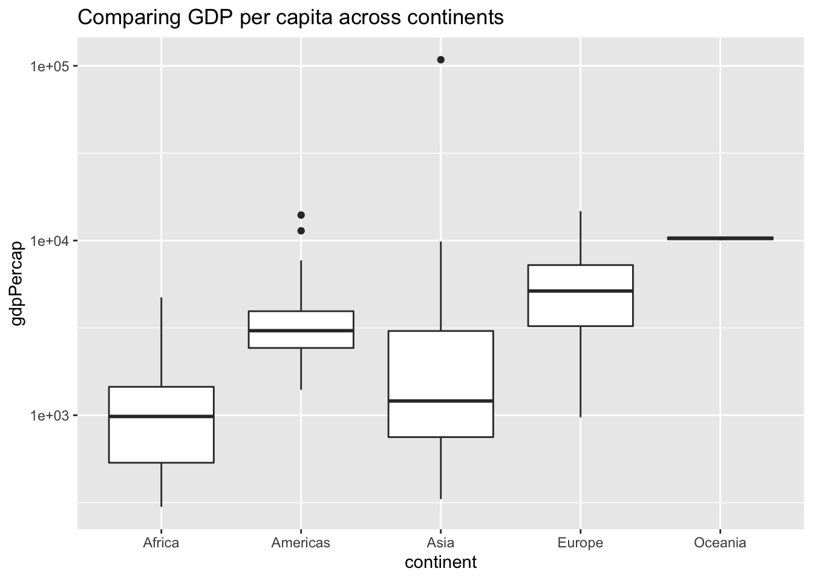

# Intro to the Tidyverse

<https://learn.datacamp.com/courses/introduction-to-the-tidyverse>

## Data wrangling
The following info goes into how to select (filter), arrange, add, change (mutate) specific variables and observations. Install these two packages so codes below work properly:

    install.packages("gapminder")
    install.packages("dplyr")

**Loading the gapminder and dplyr packages**


```r
# Load the gapminder package
library(gapminder)
# Load the dplyr package
library(dplyr)
```

```
## 
## Attaching package: 'dplyr'
```

```
## The following objects are masked from 'package:stats':
## 
##     filter, lag
```

```
## The following objects are masked from 'package:base':
## 
##     intersect, setdiff, setequal, union
```

```r
# Look at the gapminder dataset
gapminder
```

```
## # A tibble: 1,704 × 6
##    country     continent  year lifeExp      pop gdpPercap
##    <fct>       <fct>     <int>   <dbl>    <int>     <dbl>
##  1 Afghanistan Asia       1952    28.8  8425333      779.
##  2 Afghanistan Asia       1957    30.3  9240934      821.
##  3 Afghanistan Asia       1962    32.0 10267083      853.
##  4 Afghanistan Asia       1967    34.0 11537966      836.
##  5 Afghanistan Asia       1972    36.1 13079460      740.
##  6 Afghanistan Asia       1977    38.4 14880372      786.
##  7 Afghanistan Asia       1982    39.9 12881816      978.
##  8 Afghanistan Asia       1987    40.8 13867957      852.
##  9 Afghanistan Asia       1992    41.7 16317921      649.
## 10 Afghanistan Asia       1997    41.8 22227415      635.
## # … with 1,694 more rows
```

**Filter, Arrange, And Mutate Verbs**

<center>**Filter Verb**</center>

The `filter` verb extracts particular observations based on a condition. The `==`is to compare two values.


```r
# Filter for China in 2002
gapminder %>%
    filter(country == "China",year == 2002)
```

```
## # A tibble: 1 × 6
##   country continent  year lifeExp        pop gdpPercap
##   <fct>   <fct>     <int>   <dbl>      <int>     <dbl>
## 1 China   Asia       2002    72.0 1280400000     3119.
```

<center>**Arrange Verb**</center>

use arrange() to sort observations in ascending or descending order of a particular variable:


```r
# Sort in ascending order of lifeExp
gapminder %>%
    arrange(lifeExp)
```

```
## # A tibble: 1,704 × 6
##    country      continent  year lifeExp     pop gdpPercap
##    <fct>        <fct>     <int>   <dbl>   <int>     <dbl>
##  1 Rwanda       Africa     1992    23.6 7290203      737.
##  2 Afghanistan  Asia       1952    28.8 8425333      779.
##  3 Gambia       Africa     1952    30    284320      485.
##  4 Angola       Africa     1952    30.0 4232095     3521.
##  5 Sierra Leone Africa     1952    30.3 2143249      880.
##  6 Afghanistan  Asia       1957    30.3 9240934      821.
##  7 Cambodia     Asia       1977    31.2 6978607      525.
##  8 Mozambique   Africa     1952    31.3 6446316      469.
##  9 Sierra Leone Africa     1957    31.6 2295678     1004.
## 10 Burkina Faso Africa     1952    32.0 4469979      543.
## # … with 1,694 more rows
```

```r
# Sort in descending order of lifeExp
gapminder %>%
    arrange(desc(lifeExp))
```

```
## # A tibble: 1,704 × 6
##    country          continent  year lifeExp       pop gdpPercap
##    <fct>            <fct>     <int>   <dbl>     <int>     <dbl>
##  1 Japan            Asia       2007    82.6 127467972    31656.
##  2 Hong Kong, China Asia       2007    82.2   6980412    39725.
##  3 Japan            Asia       2002    82   127065841    28605.
##  4 Iceland          Europe     2007    81.8    301931    36181.
##  5 Switzerland      Europe     2007    81.7   7554661    37506.
##  6 Hong Kong, China Asia       2002    81.5   6762476    30209.
##  7 Australia        Oceania    2007    81.2  20434176    34435.
##  8 Spain            Europe     2007    80.9  40448191    28821.
##  9 Sweden           Europe     2007    80.9   9031088    33860.
## 10 Israel           Asia       2007    80.7   6426679    25523.
## # … with 1,694 more rows
```

<center>**Mutate Verb**</center>

`mutate()` changes or adds variables:


```r
# Use mutate to change lifeExp to be in months
gapminder %>%
    mutate(lifeExp = 12 * lifeExp)
```

```
## # A tibble: 1,704 × 6
##    country     continent  year lifeExp      pop gdpPercap
##    <fct>       <fct>     <int>   <dbl>    <int>     <dbl>
##  1 Afghanistan Asia       1952    346.  8425333      779.
##  2 Afghanistan Asia       1957    364.  9240934      821.
##  3 Afghanistan Asia       1962    384. 10267083      853.
##  4 Afghanistan Asia       1967    408. 11537966      836.
##  5 Afghanistan Asia       1972    433. 13079460      740.
##  6 Afghanistan Asia       1977    461. 14880372      786.
##  7 Afghanistan Asia       1982    478. 12881816      978.
##  8 Afghanistan Asia       1987    490. 13867957      852.
##  9 Afghanistan Asia       1992    500. 16317921      649.
## 10 Afghanistan Asia       1997    501. 22227415      635.
## # … with 1,694 more rows
```

```r
# Use mutate to create a new column called lifeExpMonths
gapminder %>%
    mutate(lifeExpMonths = 12 * lifeExp) 
```

```
## # A tibble: 1,704 × 7
##    country     continent  year lifeExp      pop gdpPercap lifeExpMonths
##    <fct>       <fct>     <int>   <dbl>    <int>     <dbl>         <dbl>
##  1 Afghanistan Asia       1952    28.8  8425333      779.          346.
##  2 Afghanistan Asia       1957    30.3  9240934      821.          364.
##  3 Afghanistan Asia       1962    32.0 10267083      853.          384.
##  4 Afghanistan Asia       1967    34.0 11537966      836.          408.
##  5 Afghanistan Asia       1972    36.1 13079460      740.          433.
##  6 Afghanistan Asia       1977    38.4 14880372      786.          461.
##  7 Afghanistan Asia       1982    39.9 12881816      978.          478.
##  8 Afghanistan Asia       1987    40.8 13867957      852.          490.
##  9 Afghanistan Asia       1992    41.7 16317921      649.          500.
## 10 Afghanistan Asia       1997    41.8 22227415      635.          501.
## # … with 1,694 more rows
```

<center>**Combining Filter, Mutate, And Arrange**</center>


```r
# Filter, mutate, and arrange the gapminder dataset
gapminder %>%
    filter(year == 2007) %>%
        mutate(lifeExpMonths = 12 * lifeExp) %>%
    arrange(desc(lifeExpMonths))
```

```
## # A tibble: 142 × 7
##    country          continent  year lifeExp       pop gdpPercap lifeExpMonths
##    <fct>            <fct>     <int>   <dbl>     <int>     <dbl>         <dbl>
##  1 Japan            Asia       2007    82.6 127467972    31656.          991.
##  2 Hong Kong, China Asia       2007    82.2   6980412    39725.          986.
##  3 Iceland          Europe     2007    81.8    301931    36181.          981.
##  4 Switzerland      Europe     2007    81.7   7554661    37506.          980.
##  5 Australia        Oceania    2007    81.2  20434176    34435.          975.
##  6 Spain            Europe     2007    80.9  40448191    28821.          971.
##  7 Sweden           Europe     2007    80.9   9031088    33860.          971.
##  8 Israel           Asia       2007    80.7   6426679    25523.          969.
##  9 France           Europe     2007    80.7  61083916    30470.          968.
## 10 Canada           Americas   2007    80.7  33390141    36319.          968.
## # … with 132 more rows
```

## Data visualization

Make sure to load the `ggplot2` package. `ggplot2` will allow the visualization of data into graphs.


```r
library(ggplot2)

gapminder_1952 <- gapminder %>%
  filter(year == 1952)

#Create a plot to compare population and life expectancy
ggplot(gapminder_1952, aes(x = pop, y = lifeExp)) + geom_point()
```



`geom_point()` stands for "geometric", and the "point" tells R that it's a scatter plot. `aes()` stands for aesthetic.
The data is too cramped up to the left of the plot so use "log scales" to distribute the data better.

***Log Scale**


```r
# Scatter plot comparing pop and gdpPercap, with both axes on a log scale
ggplot(gapminder_1952, aes(x = pop, y = gdpPercap)) + geom_point() +scale_x_log10() + scale_y_log10()
```



the newly added "log_scales" has created a better looking graph by adjusting the scale of the x-axis.

**Additional Aesthetic Functions**

<center>**Color And Size**</center>

Adding color to a scatter plot can be used to show which continent each point in a scatter plot represents. Then, adding size can be used to show the magnitude of each observations:


```r
# Add the color, and size aesthetics to represent the continents and the country's gdpPercap
ggplot(gapminder_1952, aes(x = pop, y = lifeExp, color = continent, size = gdpPercap)) +
  geom_point() +
  scale_x_log10()
```


<center>**Faceting/Subgraphs**</center>

Use `facet_wrap(~ )` function to divide a graph into subplots based on one of its variables:


```r
# Scatter plot comparing pop and lifeExp, faceted by continent
ggplot(gapminder_1952, aes(x = pop, y = lifeExp)) + geom_point() + scale_x_log10() + facet_wrap(~ continent)
```


## Grouping and summarizing

**Summarize Verb**

The function `summarize()` combines many observations from the same variable into one:


```r
# Filter for 1957 then summarize the median life expectancy and the maximum GDP per capita
gapminder %>%
    filter(year == 1957) %>%
        summarize(medianLifeExp = median(lifeExp), maxGdpPercap = max(gdpPercap))
```

```
## # A tibble: 1 × 2
##   medianLifeExp maxGdpPercap
##           <dbl>        <dbl>
## 1          48.4      113523.
```

In this case, the code summarized the median life expectancy and maximum GDP/capita of all the countries and conitents from 1957. 

**Group_by Verb**

This function `group_by()` is basically an advanced version of the `filter()` function. If the `filter()` along with the `summarize()` functions can summarize observations of variable(s) one of each filtered type at a time, then `group_by()` function can run the same calculations for all the observation units:


```r
# Find median life expectancy and maximum GDP per capita in each year
gapminder %>%
    group_by(year) %>%
        summarize(medianLifeExp = median(lifeExp), maxGdpPercap = max(gdpPercap))
```

```
## # A tibble: 12 × 3
##     year medianLifeExp maxGdpPercap
##    <int>         <dbl>        <dbl>
##  1  1952          45.1      108382.
##  2  1957          48.4      113523.
##  3  1962          50.9       95458.
##  4  1967          53.8       80895.
##  5  1972          56.5      109348.
##  6  1977          59.7       59265.
##  7  1982          62.4       33693.
##  8  1987          65.8       31541.
##  9  1992          67.7       34933.
## 10  1997          69.4       41283.
## 11  2002          70.8       44684.
## 12  2007          71.9       49357.
```

**Visualizing the dataset**

Assigning the dataset to a variable then plug it in to the `ggplot2` to make a graph:

```r
# Summarize medianGdpPercap within each continent within each year: by_year_continent
by_year_continent <- gapminder %>%
        group_by(continent, year) %>%
            summarize(medianGdpPercap = median(gdpPercap))
```

```
## `summarise()` has grouped output by 'continent'. You can override using the
## `.groups` argument.
```

```r
# Plot the change in medianGdpPercap in each continent over time
ggplot(by_year_continent, aes(x = year, y = medianGdpPercap, color = continent)) + geom_point() + expand_limits(y = 0)
```



## Types of visualizations

**Line Plot**

A line plot is useful for visualizing trends over time. Use `geom_line()` to create a line plot instead of `geom_point()` to create a scatter plot. The function `expand_limits(y = 0)` tells the y-axis to start from `0`:


```r
# Create a line plot showing the change in medianGdpPercap by continent over time
ggplot(by_year_continent, aes(x = year, y = medianGdpPercap, color = continent)) + geom_line() + expand_limits(y = 0)
```



**Bar Plot**

A bar plot is useful for visualizing summary statistics. use `geom_col()` to create a bar plot:


```r
# Filter for observations in the Oceania continent in 1952
oceania_1952 <- gapminder %>%
    filter(continent == "Oceania", year == 1952)

# Create a bar plot of gdpPercap by country
ggplot(oceania_1952, aes(x = country, y = gdpPercap)) + geom_col()
```



**Histogram**

A histogram is useful for examining the distribution of a numeric variable. Every bar represents a `bin` of a variable, and the height of the bar represents how many observations fall into that `bin`. Use `geom_histogram()` to create a histogram:


```r
gapminder_1952 <- gapminder %>%
  filter(year == 1952) %>%
  mutate(pop_by_mil = pop / 1000000)

# Create a histogram of population (pop_by_mil)
ggplot(gapminder_1952, aes(x = pop_by_mil)) + geom_histogram(bins = 50)
```



**Boxplot**

A boxplot is useful for comparing a distribution of values across several groups.


```r
# Create a boxplot comparing gdpPercap among continents
ggplot(gapminder_1952, aes(x = continent, y = gdpPercap)) + geom_boxplot() + scale_y_log10()
```


**How To Add A Title To A Graph**

Use `ggtitle()` function to add a title to a graph:


```r
# Add a title to this graph: "Comparing GDP per capita across continents"
ggplot(gapminder_1952, aes(x = continent, y = gdpPercap)) +
  geom_boxplot() +
  scale_y_log10() +
  ggtitle("Comparing GDP per capita across continents")
```



