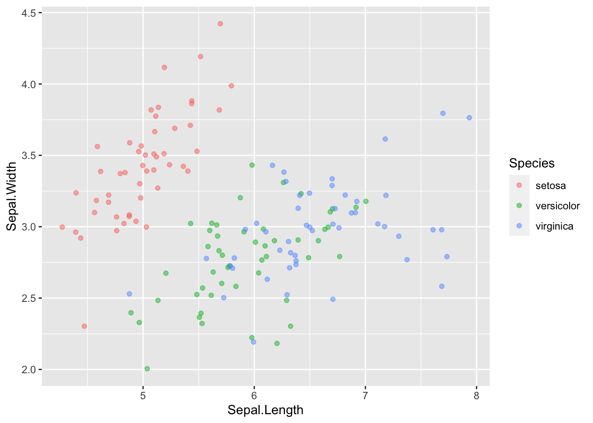
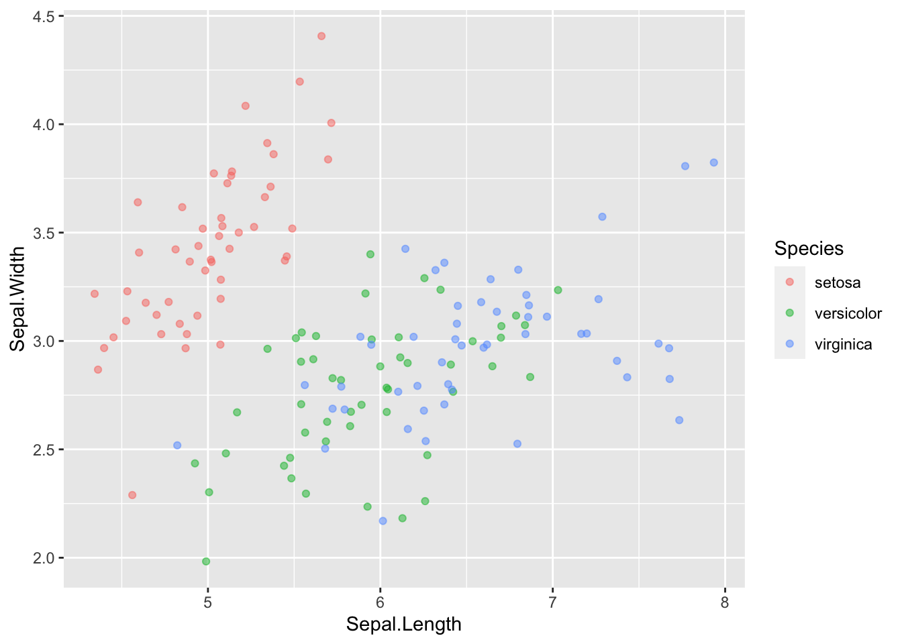
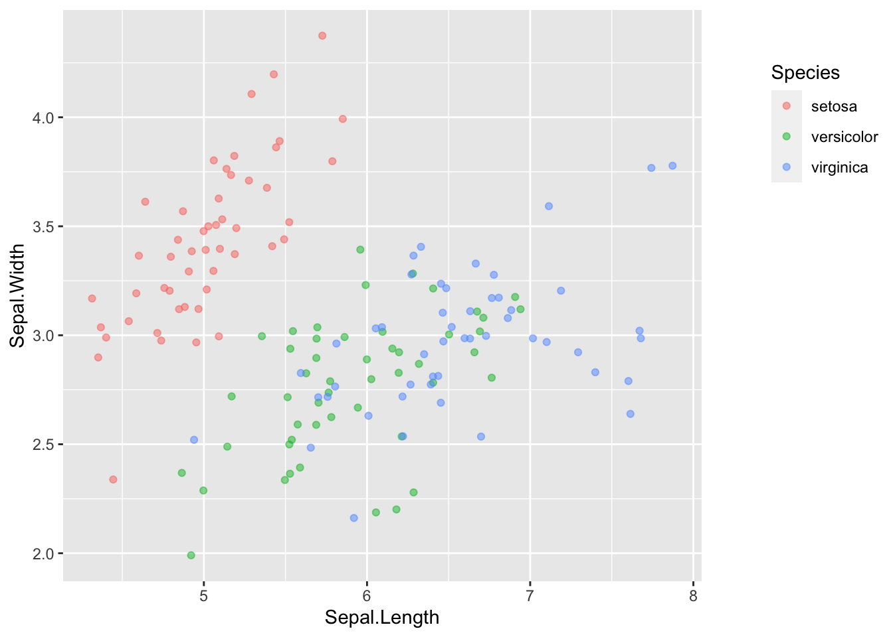

# Intro to Data Visualization with ggplot2

<https://learn.datacamp.com/courses/introduction-to-data-visualization-with-ggplot2>

## Introduction

**Changing One Geom Or Every Geom**

If you have multiple geoms, then mapping an aesthetic to data variable inside the call to `ggplot()` will change all the geoms. It is also possible to make changes to individual geoms by passing arguments to the `geom_*()` functions.

`geom_point()` has an alpha argument that controls the opacity of the points. A value of `1` (the default) means that the points are totally opaque; a value of `0` means the points are totally transparent (and therefore invisible). Values in between specify transparency.

`geom_smooth()` adds a smooth trend curve.


```r
ggplot(diamonds, aes(carat, price, color = clarity)) +
  geom_point(alpha = 0.4) +
  geom_smooth()
```

```
## `geom_smooth()` using method = 'gam' and formula 'y ~ s(x, bs = "cs")'
```


**Saving Plots As Variables**

Plots can be saved as variables, which can be added two later on using the + operator. This is really useful to make multiple related plots from a common base.


```r
# Assign the previous plot to a variable to make a base:
plt_price_vs_carat <- ggplot(diamonds, aes(carat, price))

# Assign the base plot to make a new plot:
plt_price_vs_carat_by_clarity <- plt_price_vs_carat + geom_point(aes(color = clarity))

# See the plot
plt_price_vs_carat_by_clarity
```


## Aesthetics

**Typical Visible Aesthetics**


```
##   Aesthetic                                  Description
## 1         x                              X-axis position
## 2         y                              Y-axis position
## 3      fill                                   Fill color
## 4     color     Color of points, outlines of other geoms
## 5      size Area or radius of points, thickness of lines
## 6     alpha                                 Transparency
## 7  linetype                            Line dash pattern
## 8    labels                       Text on a plot or axes
## 9     shape                                        Shape
```

**All About Aesthetics: Color, Shape And Size**

These are the aesthetics to can consider within `aes()`: `x`, `y`, `color`, `fill`, `size`, `alpha`, `labels` and `shape.`


```r
diamonds
```

```
## # A tibble: 53,940 × 10
##    carat cut       color clarity depth table price     x     y     z
##    <dbl> <ord>     <ord> <ord>   <dbl> <dbl> <int> <dbl> <dbl> <dbl>
##  1  0.23 Ideal     E     SI2      61.5    55   326  3.95  3.98  2.43
##  2  0.21 Premium   E     SI1      59.8    61   326  3.89  3.84  2.31
##  3  0.23 Good      E     VS1      56.9    65   327  4.05  4.07  2.31
##  4  0.29 Premium   I     VS2      62.4    58   334  4.2   4.23  2.63
##  5  0.31 Good      J     SI2      63.3    58   335  4.34  4.35  2.75
##  6  0.24 Very Good J     VVS2     62.8    57   336  3.94  3.96  2.48
##  7  0.24 Very Good I     VVS1     62.3    57   336  3.95  3.98  2.47
##  8  0.26 Very Good H     SI1      61.9    55   337  4.07  4.11  2.53
##  9  0.22 Fair      E     VS2      65.1    61   337  3.87  3.78  2.49
## 10  0.23 Very Good H     VS1      59.4    61   338  4     4.05  2.39
## # … with 53,930 more rows
```

```r
ggplot(diamonds, aes(carat, price, color = color)) +
  # Set the shape and size of the points
  geom_point(shape = 1, size = 1.5)
```


**All About Aesthetics: Color VS. Fill**

Typically, the `color` aesthetic changes the circumference line of a geom and the `fill` aesthetic changes the inside. `geom_point()` is an exception: you use `color` (not `fill`) for the point color. 

The default `geom_point()` uses `shape = 19`: a solid circle. An alternative is `shape = 21`: a circle that allow you to use both `fill` for the inside and `color` for the outline. This is lets you to map two aesthetics to each point:


```r
ggplot(diamonds, aes(carat, price, fill = clarity, color = color)) +
  geom_point(shape = 21, size = 4, alpha = 0.6)
```


**All About Aesthetics: Alpha, Shape And Label**

<center>**Be careful**: the attributes can overwrite the aesthetics of a plot!</center>

<center>**Alpha**</center>


```r
# Base layer
diamonds_E <- diamonds %>%
  filter(color == "E")

plt_diam_E <- ggplot(diamonds_E, aes(carat, price))

# Map clarity to alpha:
plt_diam_E +
  geom_point(aes(alpha = clarity))
```


<center>**Shape**</center>

Use `shape()` function to substitute the observation symbols displayed in the plot into another variable:

```r
# Base layer
diamonds_E <- diamonds %>%
  filter(color == "E")

plt_diam_E <- ggplot(diamonds_E, aes(carat, price))

# Map cut to alpha:
plt_diam_E +
  geom_point(aes(shape = cut))
```

```
## Warning: Using shapes for an ordinal variable is not advised
```


<center>**Label**</center>

Use `label()` function to change the observation symbols displayed in the plot:

```r
diamonds_Fair <- diamonds %>%
  filter(cut == "Fair")

plt_diam_Fair <- ggplot(diamonds_Fair, aes(carat, price))

# Use text layer and map color to label
plt_diam_Fair +
  geom_text(aes(label = color))
```


**All About Attributes: Color, Shape, And Size**

Use `color()`, `shape()`, and `size()` functions as attributes (means to not use inside `ggplot()`):

```r
# A hexadecimal color
my_blue <- "#4ABEFF"

# Change the color mapping to a fill mapping
ggplot(diamonds_Fair, aes(carat, price, fill = "E")) +
  # Set point size and shape
geom_point(color = my_blue, size = 7, shape = 5, alpha = 0.4)
```


**Aesthetic Label Functions**

Make use some of these functions for improving the appearance of the plot:

`labs()` to set the x- and y-axis labels. It takes strings for each argument.
    
`scale_color_manual()` defines properties of the color scale (i.e. axis). The first argument sets the legend title. values is a named vector of colors to use.


```r
palette <- c(E = "#377EB8")

ggplot(diamonds_Fair, aes(carat, price, fill = "E")) +
  geom_point(color = my_blue, size = 7, shape = 5, alpha = 0.4) +  
    labs(x = "This is a new x-axis name", y = "New for Y") +
      scale_fill_manual("Color of the Diamonds", values = palette)
```


**Setting Axis Limits**

Specify the limits as separate arguments, or as a single numeric vector. That is, `ylim(lo, hi)` or `ylim(c(lo, hi))`.


```r
ggplot(mtcars, aes(mpg, 0)) +
  geom_jitter() +
  # Set the y-axis limits
  ylim(-2, 2)
```


To spread out clustered variables use `geom_jitter()` or `geom_point(position = "jitter")`.

## Geometries

Scatter plots (using geom_point()) are intuitive, easily understood, and very common, but we must always consider overplotting, particularly in the following four situations:

    1. Large datasets
    2. Aligned values on a single axis
    3. Low-precision data
    4. Integer data

**How to Deal with Overplotting In Scatter Plots**

Adjust the numeric value in `shape()` function into `"."`to deal with overflowed data:

```r
# Plot price vs. carat, colored by clarity
plt_price_vs_carat_by_clarity <- ggplot(diamonds, aes(carat, price, color = clarity))

# Add a point layer with tiny points
plt_price_vs_carat_by_clarity + geom_point(alpha = 0.5, shape = ".")
```


**How to Deal with "Aligned Values" And "Low-precision Data" In Scatter Plots**

Aligning values on a single axis occurs when one axis is continuous and the other is categorical, which can be overcome with some form of jittering:


```r
ggplot(iris, aes(Sepal.Length, Sepal.Width, color = Species)) +
  # Set the position to jitter
  geom_point(position = "jitter", alpha = 0.5)
```



Another way to jitter which gives the same result is:


```r
ggplot(iris, aes(Sepal.Length, Sepal.Width, color = Species)) +
  # Use a jitter position function with width 0.1
  geom_point(position = position_jitter(width = 0.1), alpha = 0.5) 
```



**Positions In Histograms**

Histograms are specialized versions of bar plots. 
There're various ways of applying positions to histograms. `geom_histogram()`, a special case of `geom_bar()`, has a `position` argument that can take on the following values:

1. `stack` (the default): Bars for different groups are stacked on top of each other.

2. `dodge`: Bars for different groups are placed side by side.
    
    geom_histogram(binwidth = 1, position = "dodge")
    
3. `fill`: Bars for different groups are shown as proportions.
    
    geom_histogram(binwidth = 1, position = "fill")
    
4. `identity`: Plot the values as they appear in the dataset.

    geom_histogram(binwidth = 1, position = "identity", alpha = 0.4)

**Bar Plots**

`geom_bar()` counts the number of cases at each x position.

`geom_col()` plot actual values. 

**NOTE:**the function geom_col() is just geom_bar() where both the position and stat arguments are set to "identity". It is used when we want the heights of the bars to represent the exact values in the data.

`geom_bar()` have three position options:

1. stack: The default
    
2. `dodge`: Preferred

    geom_bar(position = "dodge")
    
3. `fill`: To show proportions

    geom_bar(position = "fill")
    
**Overlapping Bar Plots**

Instead of using `position = "dodge"`, use `position_dodge()`, the same with `position_jitter()` to specify how much dodging (or jittering) wanted.

    geom_bar(position = position_dodge(width = 0.2))

## Themes

The themes layer is the visual elements that aren't part of the data. There're 3 types: 


```
##       types modified_using
## 1      text element_text()
## 2      line element_line()
## 3 rectangle element_rect()
```

To change stylistic elements of a plot, call theme() and set plot properties to a new value.

**Moving The Legend**

The `legend` is that little box on the right side of the plot that shows up when functions like `color` or `shape` is plotted:

    p + theme(legend.position = new_value)
    
The new value can be:

    "top", "bottom", "left", or "right'": place it at that side of the plot.
    "none": don't draw it.
   " c(x, y)": "c(0, 0)" means the bottom-left and "c(1, 1)" means the top-right.
   

```r
ggplot(iris, aes(Sepal.Length, Sepal.Width, color = Species)) +
  geom_point(position = position_jitter(width = 0.1), alpha = 0.5) +
    
  theme(legend.position = "left")
```


**Modifying Theme Elements**

Many plot elements have multiple properties that can be set. 

Line elements in the plot such as axes and gridlines have a color, a thickness (`size`), and a line type (`solid` line, `dashed`, or `dotted`). To set the style of a line, you use `element_line()`. For example, to make the axis lines into `red`, `dashed` lines:

    p + theme(axis.line = element_line(color = "red", linetype = "dashed"))


Similarly, `element_rect()` changes `rectangles` and `element_text()` changes `text.` To remove a plot element, use `element_blank()`.


```r
ggplot(iris, aes(Sepal.Length, Sepal.Width, color = Species)) +
  geom_point(position = position_jitter(width = 0.1), alpha = 0.5) +
    theme(legend.position = "left",
          rect = element_rect(fill = "grey92"),
            legend.key = element_rect(color = NA),
            # Turn off axis ticks
            axis.ticks = element_blank(),
            # Turn off the panel grid
            panel.grid = element_blank()
          )
```


**Modifying Whitespace**

*Whitespace* means all the non-visible margins and spacing in the plot.

To set a single *whitespace* value, use `unit(x, unit)`, where `x` is the amount and `unit` is the unit of measure.

Borders have 4 positions, use `margin(top, right, bottom, left, unit)`. The margin order is in a clock-wise position starting from 12 o'clock.

The default unit is `"pt"` (points), which scales well with text. Other options include `"cm"`, `"in"` (inches) and `"lines"` (of text).


```r
ggplot(iris, aes(Sepal.Length, Sepal.Width, color = Species)) +
  geom_point(position = position_jitter(width = 0.1), alpha = 0.5) +
    
  theme(legend.margin = margin(1, 1, 70, 10, "mm"))
```



**Built-in Themes**

In addition to making your own themes, there are several out-of-the-box solutions that may save you lots of time.

    "theme_gray()" is the default.
    "theme_bw()" is useful when you use transparency.
    "theme_classic()" is more traditional.
    "theme_void()" removes everything but the data.

**Setting Themes**

Install the package `ggthemes`, which is a another source of built-in themes just like `ggplot2`.


Reusing a theme across many plots helps to provide a consistent style. You have several options for this.

    1. Assign the theme to a variable, and add it to each plot.
    2. Set the theme as the default using "theme_set()".


```r
library(ggthemes)

new_theme <- theme(
  rect = element_rect(fill = "grey92"),
  legend.key = element_rect(color = NA),
  axis.ticks = element_blank(),
  panel.grid = element_blank(),
  panel.grid.major.y = element_line(color = "white", size = 0.5, linetype = "dotted"),
  axis.text = element_text(color = "grey25"),
  plot.title = element_text(face = "italic", size = 16),
  legend.position = c(0.6, 0.1)
   )

# Combine the WSJ theme with new_theme
new_theme_wsj <- theme_wsj() + new_theme

# Add the combined theme to the plot
ggplot(iris, aes(Sepal.Length, Sepal.Width, color = Species)) +
  geom_point(position = position_jitter(width = 0.1), alpha = 0.5) +
  
  new_theme_wsj
```


**NOTE:** add another theme after an already existing theme to overide the settings of the previous theme. 

**Using Geoms For Explanatory Plots**

This type of plot will be in an info-viz style, meaning that it would be similar to something you'd see in a magazine or website for a mostly lay audience.


```r
# Add a geom_segment() layer (Key component to create the plot structure below)
ggplot(gm2007, aes(x = lifeExp, y = country, color = lifeExp)) +
  geom_point(size = 4) +
  geom_segment(aes(xend = 30, yend = country), size = 2) +
  
# Add a geom_text() layer
  geom_text(aes(label = round(lifeExp,1)), color = "white", size = 1.5) +
  
# Modify the scales
  scale_x_continuous("", expand = c(0,0), limits = c(30,90), position = "top") +
  
# Add a title and caption
  labs(title = "Highest and lowest life expectancies, 2007", caption = "Source: gapminder")
```


