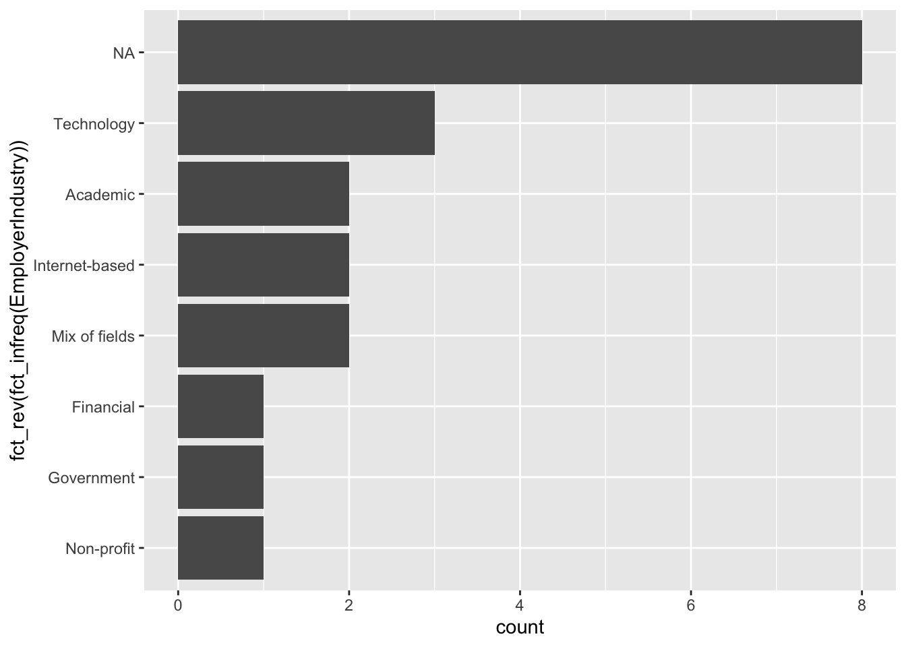
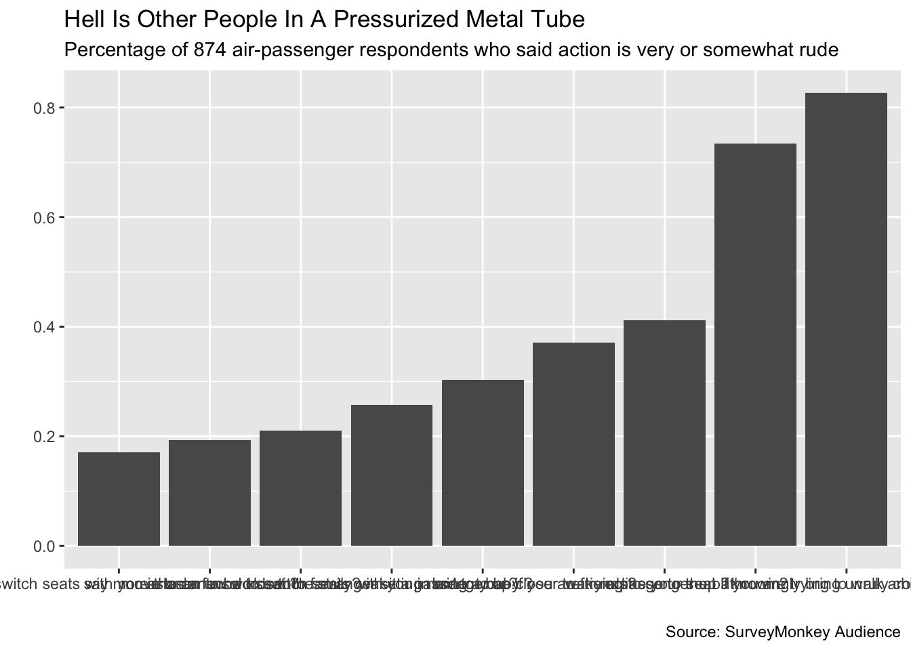

# Categorical Data in the Tidyverse

<https://learn.datacamp.com/courses/categorical-data-in-the-tidyverse>

Required packages to load:


```r
library(ggplot2)
library(dplyr)
```

```
## 
## Attaching package: 'dplyr'
```

```
## The following objects are masked from 'package:stats':
## 
##     filter, lag
```

```
## The following objects are masked from 'package:base':
## 
##     intersect, setdiff, setequal, union
```

```r
library(tidyr)
library(readr)
library(forcats)
library(stringr)
library(scales)
```

```
## 
## Attaching package: 'scales'
```

```
## The following object is masked from 'package:readr':
## 
##     col_factor
```

## Introduction to Factor Variables

**Getting Number Of Levels**

`mutate()` and `summarise()` in `dplyr` both have variants to add the suffix `if` or `all` to change the operation. `mutate_if()` and `summarise_if` apply their "second argument"-a function, to all columns where the "first argument" is true, and `mutate_all()` and `summarise_all` take one argument, a function, and apply it to all columns.


```r
# Change all the character columns to factors
responses_as_factors <- multiple_choice_responses %>%
    mutate_if(is.character, as.factor)

number_of_levels <- responses_as_factors %>%
	# apply the function nlevels to each column
    summarise_all(nlevels) %>%
    # change the dataset from wide to long
    gather(variable, num_levels)

number_of_levels[1:8,]
```

```
## # A tibble: 8 × 2
##   variable                              num_levels
##   <chr>                                      <int>
## 1 LearningPlatformUsefulnessArxiv                2
## 2 LearningPlatformUsefulnessBlogs                2
## 3 LearningPlatformUsefulnessCollege              2
## 4 LearningPlatformUsefulnessCompany              1
## 5 LearningPlatformUsefulnessConferences          2
## 6 LearningPlatformUsefulnessFriends              1
## 7 LearningPlatformUsefulnessKaggle               2
## 8 LearningPlatformUsefulnessNewsletters          1
```

**Examining Number Of Levels**

`dplyr` has two other functions to explore a dataset. The first is `top_n(x, var)`, which give the first `x` rows of a dataset based on the value of `var.` 


```r
mtcars %>%
  top_n(2, mpg)
```

```
##                 mpg cyl disp hp drat    wt  qsec vs am gear carb
## Fiat 128       32.4   4 78.7 66 4.08 2.200 19.47  1  1    4    1
## Toyota Corolla 33.9   4 71.1 65 4.22 1.835 19.90  1  1    4    1
```

The other is` pull()`, which allows extraction of a column and take out the name, leaving only the value(s) from the column.

`pull` can be used interchangeably with`$`as a way to extract a column as a vector from a table. For example, `mean(mtcars$mpg)` is the same as `mean(mtcars %>% pull(mpg))` or `mtcars %>% pull(mpg) %>% mean()`.


```r
mtcars %>%
  top_n(2, mpg) %>%
    pull(mpg)
```

```
## [1] 32.4 33.9
```

**Reordering A Variable By Its Frequency**

One of the primary purposes of the `forcats` package is to make it easy to quickly change visualizations when working with qualitative variables.

Flip the coordinates using `coord_flip()` to make it more readable.

Use `fct_infreq()` to make the bar plot ordered by frequency. 

Use `fct_rev()` to reverse the order of a factor.

Use `fct_reorder()` from `forcats` to take one variable and order it by another.


```r
# Make a bar plot 
ggplot(multiple_choice_responses, aes(x = fct_rev(fct_infreq(EmployerIndustry)))) + 
    geom_bar() + 
# flip the coordinates
    coord_flip()
```



## Manipulating Factor Variables

**How To Change The Order Of Levels**

Use `fct_relevel()` to change the order of factor levels.


```r
# Get the levels of WorkInternalVsExternalTools
levels(responses_data$WorkInternalVsExternalTools)
```

```
## [1] "Approximately half internal and half external"
## [2] "Do not know"                                  
## [3] "Entirely external"                            
## [4] "Entirely internal"                            
## [5] "More external than internal"                  
## [6] "More internal than external"
```

```r
# Reorder the levels from internal to external 
reordered_respsonses <- responses_data[1:8,] %>%
    mutate(WorkInternalVsExternalTools = fct_relevel(WorkInternalVsExternalTools,
                                            "Entirely internal", 
                                             "More internal than external",
                                             "Approximately half internal and half external",
                                             "More external than internal", 
                                             "Entirely external",
                                             "Do not know"))
```

 Sometimes, a data have many levels and only need to move one. Instead of writing out all the levels, use some     arguments in `fct_relevel()` to save time.

In the code below, using `after = Inf` will move the specified level to the last, if `after = n`, in which `n` is a number, then that specified level will the reordered to after that `n`th place. 
 

```r
# Reorder the levels from internal to external 
somwhat_reordered <- responses_data %>%
# Move "Do not know" to be the last level.
    mutate(WorkInternalVsExternalTools = fct_relevel(WorkInternalVsExternalTools, "Do not know", after = Inf)) %>%
# Move "Entirely internal" and ""Approximately half internal and half external" to the front
    mutate(WorkInternalVsExternalTools = fct_relevel(WorkInternalVsExternalTools, "Entirely internal", "Approximately half internal and half external")) 

# Get the levels of WorkInternalVsExternalTools
levels(somwhat_reordered$WorkInternalVsExternalTools) 
```

```
## [1] "Entirely internal"                            
## [2] "Approximately half internal and half external"
## [3] "Entirely external"                            
## [4] "More external than internal"                  
## [5] "More internal than external"                  
## [6] "Do not know"
```

**Renaming Levels**

Use `fct_recode()` to rename levels, with the new level name on the left, and the old on the right:


```r
# Reorder the levels from internal to external 
renamed_respsonses <- responses_data[1:8,] %>%
    mutate(WorkInternalVsExternalTools = fct_recode(WorkInternalVsExternalTools,
                              "Entirely In" = "Entirely internal", 
                              "More In than Out" = "More internal than external",
                              "Hald In and Out" = "Approximately half internal and half external",
                              "More Out than In" = "More external than internal", 
                              "Entirely Out" = "Entirely external",
                              "IDK" = "Do not know"))

# Get the levels of WorkInternalVsExternalTools
levels(renamed_respsonses$WorkInternalVsExternalTools)
```

```
## [1] "Hald In and Out"  "IDK"              "Entirely Out"     "Entirely In"     
## [5] "More Out than In" "More In than Out"
```

**How To Collapse/Merge Levels**

Sometimes, a dataset would have too many levels that ties to a general category, so merging those levels into one umbrella level would be easier to the eyes. Use `fct_collapse()` to collapse the levels into one.

After collapsing the desired levels into one, there would non-essential levels, classifying those unnecessary levels into `other` level would be ideal. Use `fct_other()` to turn other levels into `other`(use `keep = ` to retain the umbrella created titles)


```r
responses_data %>%
# Create new variable, grouped_titles, by collapsing levels in CurrentJobTitleSelect
    mutate(grouped_titles = fct_collapse(CurrentJobTitleSelect, 
        "Computer Scientist" = "Software Developer/Software Engineer", 

        "Data Analyst/Scientist/Engineer" = c("DBA/Database Engineer", "Data Scientist", 
                                              "Business Analyst"))) %>%
# Keep all the new titles and turn every other title into "Other"
    mutate(grouped_titles = fct_other(grouped_titles, 
                             keep = c("Computer Scientist",
                                     "Data Analyst/Scientist/Engineer"))) %>% 
# Get a count of the grouped titles
    count(grouped_titles)
```

```
## # A tibble: 4 × 2
##   grouped_titles                      n
##   <fct>                           <int>
## 1 Data Analyst/Scientist/Engineer     5
## 2 Computer Scientist                  5
## 3 Other                               2
## 4 <NA>                                8
```

**Showing Levels By Proportion**

Use `fct_lump()` to show only the selected levels that exceed the specified proportion(percentage of that level in the dataset), otherwise, collapse all the non-qualified levels into `other`).


```r
responses_data %>%
  # remove NAs of MLMethodNextYearSelect
  filter(!is.na(MLMethodNextYearSelect)) %>%
  # create ml_method, which lumps all those with less than 5% of people into "Other"
  mutate(ml_method = fct_lump(MLMethodNextYearSelect, prop = .11)) %>%
  # count the frequency of your new variable, sorted in descending order
  count(ml_method, sort = TRUE)
```

```
## # A tibble: 5 × 2
##   ml_method          n
##   <fct>          <int>
## 1 Deep learning      6
## 2 Other              4
## 3 Neural Nets        2
## 4 Random Forests     2
## 5 Text Mining        2
```

**Showing The "N" Number Most Common Levels**

Instead of showing levels by proportion but to show the most common `n` levels, use:

    fct_lump(dataset_name, n = __, other_level = "title_of_non-qualified_levels")

For example:


```r
responses_data %>%
# remove NAs 
  filter(!is.na(MLMethodNextYearSelect)) %>%
# create ml_method, retaining the first most common method and renaming others "other method" 
  mutate(ml_method = fct_lump(MLMethodNextYearSelect, n = 1, other_level = "other method")) %>%
# count the frequency of your new variable, sorted in descending order
  count(ml_method, sort = TRUE)
```

```
## # A tibble: 2 × 2
##   ml_method         n
##   <fct>         <int>
## 1 other method     10
## 2 Deep learning     6
```

## Creating Factor Variables

Use `str_remove()` from the `stringr` package to remove a certain phrase from observations in a column:


```r
platform_usefulness_long <- responses_data %>%
# select columns with LearningPlatformUsefulness in title
  select(contains("LearningPlatformUsefulness")) %>%
# change data from wide to long
  gather(learning_platform, usefulness) %>%
# remove rows where usefulness is NA
  filter(!is.na(usefulness))

platform_usefulness_long[1:7,]
```

```
## # A tibble: 7 × 2
##   learning_platform               usefulness     
##   <chr>                           <chr>          
## 1 LearningPlatformUsefulnessArxiv Very useful    
## 2 LearningPlatformUsefulnessArxiv Very useful    
## 3 LearningPlatformUsefulnessArxiv Somewhat useful
## 4 LearningPlatformUsefulnessArxiv Somewhat useful
## 5 LearningPlatformUsefulnessBlogs Very useful    
## 6 LearningPlatformUsefulnessBlogs Somewhat useful
## 7 LearningPlatformUsefulnessBlogs Very useful
```

```r
# remove "LearningPlatformUsefulness" from each string in learning_platform 
platform_usefulness_short <- platform_usefulness_long %>%
  mutate(learning_platform = str_remove(learning_platform, "LearningPlatformUsefulness"))

platform_usefulness_short[1:7,]
```

```
## # A tibble: 7 × 2
##   learning_platform usefulness     
##   <chr>             <chr>          
## 1 Arxiv             Very useful    
## 2 Arxiv             Very useful    
## 3 Arxiv             Somewhat useful
## 4 Arxiv             Somewhat useful
## 5 Blogs             Very useful    
## 6 Blogs             Somewhat useful
## 7 Blogs             Very useful
```

**How To Add A Counted Column With "add+count()"**

`add_count()` adds a column to the dataset, `n`, keeping the same number of rows as the original dataset. Just like `count()`, `n` defaults to be the number of rows for each group. Set `wt` equal to another column to make `n` equal to the sum of that column for each group:


```r
perc_useful_platform <- platform_usefulness_short %>%
  # change dataset to one row per learning_platform usefulness pair with number of entries for each
  count(learning_platform, usefulness) %>%
  # use add_count to create column with total number of answers for that learning_platform
  add_count(learning_platform, wt = n, name='nn') %>%
  # create a new column, perc, that is the percentage of people giving that response for that learning_platform
  mutate(perc = n / nn)

perc_useful_platform[1:5,]
```

```
## # A tibble: 5 × 5
##   learning_platform usefulness          n    nn  perc
##   <chr>             <chr>           <int> <int> <dbl>
## 1 Arxiv             Somewhat useful     2     4   0.5
## 2 Arxiv             Very useful         2     4   0.5
## 3 Blogs             Somewhat useful     2     5   0.4
## 4 Blogs             Very useful         3     5   0.6
## 5 College           Somewhat useful     2     5   0.4
```

**Changing And Creating Variables With "case_when()"**

Make a new categorical variable/column base on another column using `case_when()`:


```r
mtcars[1:7,] %>%
# Create the speed column/variable based on hp (horse power)
    mutate(speed = case_when(
      hp < 99 ~ "Too Slow",
      between(hp, 100, 199) ~ "Fast",
      between(hp, 200, 299) ~ "Very Fast",
      hp > 300 ~ "Super Sonic"
    )) %>%
  select(hp, speed)
```

```
##                    hp     speed
## Mazda RX4         110      Fast
## Mazda RX4 Wag     110      Fast
## Datsun 710         93  Too Slow
## Hornet 4 Drive    110      Fast
## Hornet Sportabout 175      Fast
## Valiant           105      Fast
## Duster 360        245 Very Fast
```

## Case Study on Flight Etiquette

Utilize the tools above to practice on an actual dataset:


```r
flying_etiquette <- read_csv("https://assets.datacamp.com/production/repositories/1834/datasets/bef2c6e1ef42a2f230383e080fa7379912860017/flying-etiquette.csv")
```

```
## Rows: 1040 Columns: 27
## ── Column specification ────────────────────────────────────────────────────────
## Delimiter: ","
## chr (26): How often do you travel by plane?, Do you ever recline your seat w...
## dbl  (1): RespondentID
## 
## ℹ Use `spec()` to retrieve the full column specification for this data.
## ℹ Specify the column types or set `show_col_types = FALSE` to quiet this message.
```

**Changing Characters To Factors**

There're backticks around the column name because there are spaces in the column names! Normally, underscores are used.
Use `mutate_if()` to change `character` type columns into `factor` type:


```r
flying_etiquette %>%
    # Change characters to factors
    mutate_if(is.character, as.factor) %>%
    # Filter out those who have never flown on a plane
    filter(`How often do you travel by plane?` != "Never")
```

**Reformat/Filter Selected Data For Graphing**

Reformat the data to get it in shape for plotting. The graph only looks at flier's opinions about whether different behaviors are rude, so select only those columns.


```r
gathered_data <- flying_etiquette %>%
    mutate_if(is.character, as.factor) %>%
    filter(`How often do you travel by plane?` != "Never") %>%
    # Select columns containing "rude"
    select(contains("rude")) %>%
    # Change format from wide to long
    gather(response_var, value)
```

```
## Warning: attributes are not identical across measure variables;
## they will be dropped
```

**Cleaning Up Strings**

Use `regex` or regular expressions to capture general patterns. For example, `.*science ` would match `data science ` in the string `data science rocks!`.

These are two basic notations:


```
##   Expression             Does_This
## 1          . matches any character
## 2          *    zero or more times
```


```r
gathered_data[1:4,] %>%
  select(response_var)
```

```
## # A tibble: 4 × 1
##   response_var                                   
##   <chr>                                          
## 1 Is itrude to move to an unsold seat on a plane?
## 2 Is itrude to move to an unsold seat on a plane?
## 3 Is itrude to move to an unsold seat on a plane?
## 4 Is itrude to move to an unsold seat on a plane?
```

```r
gathered_data[1:4,] %>%
    # Remove everything before and including "rude to " (with that space at the end!)
    mutate(response_var = str_remove(response_var, ".*rude to ")) %>%
    # Remove "on a plane"
    mutate(response_var = str_remove(response_var, "on a plane"))
```

```
## # A tibble: 4 × 2
##   response_var             value              
##   <chr>                    <chr>              
## 1 move to an unsold seat ? <NA>               
## 2 move to an unsold seat ? No, not rude at all
## 3 move to an unsold seat ? No, not rude at all
## 4 move to an unsold seat ? No, not rude at all
```

**Dichotomizing Variables/Simplifying Observations**

In the `value` column, there are a variety of observations that indicates a range from `not rude`, `somwhat`, to `very rude`. To make it easier to plot, to simplify/categorize the observations, split it into 2 groups, `rude` and `not rude`.


```r
gathered_data[1:10,] %>%
  pull(value)
```

```
##  [1] NA                    "No, not rude at all" "No, not rude at all"
##  [4] "No, not rude at all" "No, not rude at all" "Yes, somewhat rude" 
##  [7] "No, not rude at all" "No, not rude at all" "No, not rude at all"
## [10] "Yes, very rude"
```

Right now, our data is still in the format of one row per person per question. But for us to graph it, we'll want to change that so each row is a question with the summary information about the response to that question.


```r
rude_behaviors <- gathered_data %>%
    mutate(response_var = str_replace(response_var, '.*rude to ', '')) %>%
    mutate(response_var = str_replace(response_var, 'on a plane', '')) %>%
	# Remove rows that are NA in the value column
	filter(!is.na(value)) %>%
    mutate(rude = if_else(value %in% c("No, not rude at all", "No, not at all rude"), 0, 1)) %>%
    # Group by response_var
    group_by(response_var) %>%
    # Create perc_rude, the percent considering each behavior rude
    summarise(perc_rude = mean(rude))

rude_behaviors
```

```
## # A tibble: 9 × 2
##   response_var                                                         perc_rude
##   <chr>                                                                    <dbl>
## 1 ask someone to switch seats with you in order to be closer to famil…     0.171
## 2 ask someone to switch seats with you in order to be closer to frien…     0.258
## 3 bring a baby ?                                                           0.303
## 4 knowingly bring unruly children ?                                        0.827
## 5 move to an unsold seat ?                                                 0.193
## 6 recline your seat ?                                                      0.412
## 7 say more than a few words tothe stranger sitting next to you ?           0.211
## 8 wake a passenger up if you are trying to go to the bathroom?             0.371
## 9 wake a passenger up if you are trying to walk around?                    0.734
```

**initial Plot**

The initial plot will have a few problems that are aesthetically unpleasing. For example, there are no labels, x-axis titles are jumbled up. We'll fix it step by step:


```r
initial_plot <- rude_behaviors %>%
	# reorder response_var by perc_rude
	mutate(response_var = fct_reorder(response_var, perc_rude)) %>%
	# make a bar plot of perc_rude by response_var
	ggplot(aes(x = response_var, y = perc_rude)) + 
    geom_col()


# View your plot
initial_plot
```


**Fixing Labels**

Our initial plot displays the data, but there's a lot of work to do. Let's start with the text above and around the plot. We've seen how the ggplot2 layer `labs()` can take multiple arguments to modify the text:


```r
titled_plot <- initial_plot + 
    # Add the title, subtitle, and caption
    labs(title = "Hell Is Other People In A Pressurized Metal Tube",
         subtitle = "Percentage of 874 air-passenger respondents who said action is very or somewhat rude",
         caption = "Source: SurveyMonkey Audience", 
         # Remove the x- and y-axis labels
         x = "",
         y = "") 

titled_plot
```



**Flipping X And Y For Better Visualization**

When the labels for our x-axis run into each other, we have two main choices: change the labels to be vertical instead of horizontal or flip the axes. 


```r
flipped_plot <- titled_plot + 
    # Flip the axes
    coord_flip() + 
    # Remove the x-axis ticks and labels
    theme(axis.text.x = element_blank(),
          axis.ticks.x = element_blank())

flipped_plot
```


**Finalizing Steps**

The `FiveThirtyEight` chart displayed the bar's height above each bar. We can do this with a `geom_text()` layer. Positioning the text just right above the bar takes a few extra argument.

`position = position_dodge(0.9), vjust = 1` part of the code adjusts the percentage output position on the bar so it looks better.


```r
flipped_plot + 
    # Apply percent() to perc_rude to label above the bar with the perc value
    geom_text(aes(label = percent(perc_rude), 
                  y = perc_rude + .03), 
              position = position_dodge(0.9),
              vjust = 1)
```


