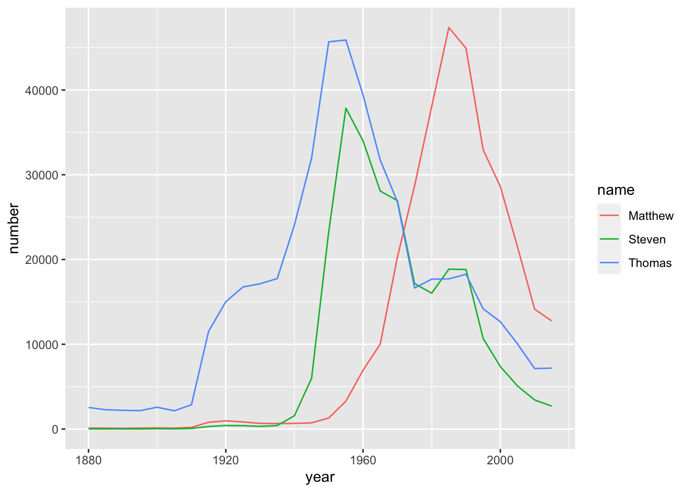

# Data Manipulation with dplyr

<https://learn.datacamp.com/courses/data-manipulation-with-dplyr>


##  Transforming Data with dplyr

**select(), mutate(), filter(), and arrange()**

For more details, go to the [Data Wrangling](https://econ380w21.github.io/bpAlNw1Ae7YwY9H3f/intro-to-the-tidyverse.html#data-wrangling) section of *Intro to the Tidyverse*.

## Aggregating Data

**count()**

A simple way to aggregate data is to count to find out the number of observations. Use `count()`:


```r
mtcars %>%
count(cyl, wt = hp, sort = TRUE)
```

```
##   cyl    n
## 1   8 2929
## 2   4  909
## 3   6  856
```

Here, `count()` sorted out the distinct observations from the `cyl` variable, the `wt` (weight) would count the total number of `hp` (horse power) for each distinct `cyl` instead of counting the total number of of observations that belongs to each distinct `vyl`.

The `wt` argument basically plug in another column to count instea.

**group_by() And summarize()**

For more details, go to the [Grouping and summarizing](https://econ380w21.github.io/bpAlNw1Ae7YwY9H3f/intro-to-the-tidyverse.html#grouping-and-summarizing) section of *Intro to the Tidyverse*.

**top_n()**

This function select the most extreme observations. The number `1` here select the highest `hp` in each distinct `cyl` observations:


```r
mtcars %>%
  select(cyl, hp)  %>%
  mutate(cyl = as.factor(cyl)) %>%
  group_by(cyl) %>%
    top_n(1, hp)
```

```
## # A tibble: 3 × 2
## # Groups:   cyl [3]
##   cyl      hp
##   <fct> <dbl>
## 1 4       113
## 2 6       175
## 3 8       335
```

For more details, go to the [Introduction to Factor Variables](https://econ380w21.github.io/bpAlNw1Ae7YwY9H3f/categorical-data-in-the-tidyverse.html#introduction-to-factor-variables) section of *Categorical Data in the Tidyverse*.

## Selecting and Transforming Data

**select() And rename()***

For more details, go to the [Tame your data](https://econ380w21.github.io/bpAlNw1Ae7YwY9H3f/working-with-data-in-the-tidyverse.html#tame-your-data) section of *Working with Data in the Tidyverse*.

**Transmute()**

The function `transmute()` is like a combination of `select` and `mutate`. It only outputs the selected variables, and allow changing, creating new variables inside the same bracket: 


```r
mtcars[1:5,] %>%
  transmute(weight_lbs = wt, weight_kg = weight_lbs / 2.205)
```

```
##                   weight_lbs weight_kg
## Mazda RX4              2.620  1.188209
## Mazda RX4 Wag          2.875  1.303855
## Datsun 710             2.320  1.052154
## Hornet 4 Drive         3.215  1.458050
## Hornet Sportabout      3.440  1.560091
```

## Case Study: The babynames Dataset


```r
babynames <- readRDS(gzcon(url("https://assets.datacamp.com/production/repositories/4984/datasets/a924ac5d86adba2e934d489cb9db446236f62b2c/babynames.rds")))

babynames
```

```
## # A tibble: 332,595 × 3
##     year name    number
##    <dbl> <chr>    <int>
##  1  1880 Aaron      102
##  2  1880 Ab           5
##  3  1880 Abbie       71
##  4  1880 Abbott       5
##  5  1880 Abby         6
##  6  1880 Abe         50
##  7  1880 Abel         9
##  8  1880 Abigail     12
##  9  1880 Abner       27
## 10  1880 Abraham     81
## # … with 332,585 more rows
```

**Filtering and arranging for one year**

Filter for only the year 1990 and sort the table in descending order of the number of babies born:


```r
babynames %>%
  # Filter for the year 1990
  filter(year == 1990) %>%
  # Sort the number column in descending order 
  arrange(desc(number))
```

```
## # A tibble: 21,223 × 3
##     year name        number
##    <dbl> <chr>        <int>
##  1  1990 Michael      65560
##  2  1990 Christopher  52520
##  3  1990 Jessica      46615
##  4  1990 Ashley       45797
##  5  1990 Matthew      44925
##  6  1990 Joshua       43382
##  7  1990 Brittany     36650
##  8  1990 Amanda       34504
##  9  1990 Daniel       33963
## 10  1990 David        33862
## # … with 21,213 more rows
```

**Using top_n with babynames**

`filter()` and `arrange()` were used to find the most common names in *one* year. However, `group_by()` and `top_n()` can be used to find the most common name in *every* year:


```r
babynames %>%
  group_by(year) %>%
  top_n(1, number)
```

```
## # A tibble: 28 × 3
## # Groups:   year [28]
##     year name  number
##    <dbl> <chr>  <int>
##  1  1880 John    9701
##  2  1885 Mary    9166
##  3  1890 Mary   12113
##  4  1895 Mary   13493
##  5  1900 Mary   16781
##  6  1905 Mary   16135
##  7  1910 Mary   22947
##  8  1915 Mary   58346
##  9  1920 Mary   71175
## 10  1925 Mary   70857
## # … with 18 more rows
```

**Visualizing names with ggplot2**

Filter for only the names Steven, Thomas, and Matthew, and assign it to an object called `selected_names`.

The `%in%` operator can be used within `filter()` by including `c()` and a vector of values.


```r
selected_names <- babynames %>%
  filter(name %in% c("Steven", "Thomas", "Matthew"))
```

Visualize the three names as a line plot over time, with each name represented by a different color:


```r
# Filter for the names Steven, Thomas, and Matthew 
selected_names <- babynames %>%
  filter(name %in% c("Steven", "Thomas", "Matthew"))

# Plot the names using a different color for each name
ggplot(selected_names, aes(x = year, y = number, color = name)) +
  geom_line()
```



**Finding the year each name is most common**

Calculate the total number of people born in that year as `year_total`. Next, use `year_total` to calculate the `fraction` of people born in each year that have each name.

Then, use the `fraction` column, in combination with `top_n()`, to identify the year each name is most common:


```r
babynames_fraction <- babynames %>%
  group_by(year) %>%
  mutate(year_total = sum(number)) %>%
  ungroup() %>%
  mutate(fraction = number / year_total) 

# Find the year each name is most common
babynames_fraction %>% 
  group_by(name) %>%
    top_n(1, fraction)
```

```
## # A tibble: 48,040 × 5
## # Groups:   name [48,040]
##     year name      number year_total  fraction
##    <dbl> <chr>      <int>      <int>     <dbl>
##  1  1880 Abbott         5     201478 0.0000248
##  2  1880 Abe           50     201478 0.000248 
##  3  1880 Abner         27     201478 0.000134 
##  4  1880 Adelbert      28     201478 0.000139 
##  5  1880 Adella        26     201478 0.000129 
##  6  1880 Adolf          6     201478 0.0000298
##  7  1880 Adolph        93     201478 0.000462 
##  8  1880 Agustus        5     201478 0.0000248
##  9  1880 Albert      1493     201478 0.00741  
## 10  1880 Albertina      7     201478 0.0000347
## # … with 48,030 more rows
```

**lag() Function**

The `lag()` function can be used to find the differences between two vectors by shifting the vectors to the right:


```r
v <- c(1, 3, 6, 14)
v
```

```
## [1]  1  3  6 14
```

```r
lag(v)
```

```
## [1] NA  1  3  6
```

**Changes in popularity of a name**

To find the changes in popularity of the name `"Matthew"` over the years, we will minus the `fraction` by the `lag` of the `fraction` to calculate the `difference` between each year. The `difference` represents the up or down of the `fraction`, which means the popularity increasing or decreasing:


```r
babynames_fraction %>%
  filter(name == "Matthew") %>%
  arrange(year) %>%
  mutate(difference = fraction - lag(fraction)) %>%
  arrange(desc(difference))
```

```
## # A tibble: 28 × 6
##     year name    number year_total fraction difference
##    <dbl> <chr>    <int>      <int>    <dbl>      <dbl>
##  1  1975 Matthew  28665    3014943 0.00951   0.00389  
##  2  1970 Matthew  20265    3604252 0.00562   0.00286  
##  3  1985 Matthew  47367    3563364 0.0133    0.00223  
##  4  1980 Matthew  38054    3439117 0.0111    0.00156  
##  5  1965 Matthew  10015    3624610 0.00276   0.00109  
##  6  1960 Matthew   6942    4152075 0.00167   0.000853 
##  7  1955 Matthew   3287    4012691 0.000819  0.000447 
##  8  1915 Matthew    798    1830351 0.000436  0.000102 
##  9  1950 Matthew   1303    3502592 0.000372  0.0000967
## 10  1910 Matthew    197     590607 0.000334  0.0000811
## # … with 18 more rows
```
