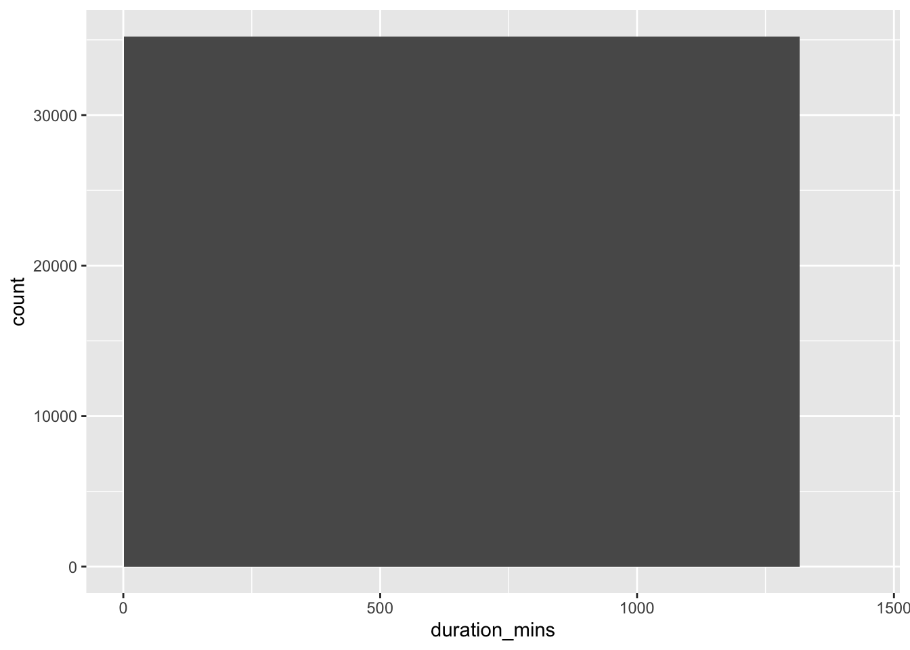
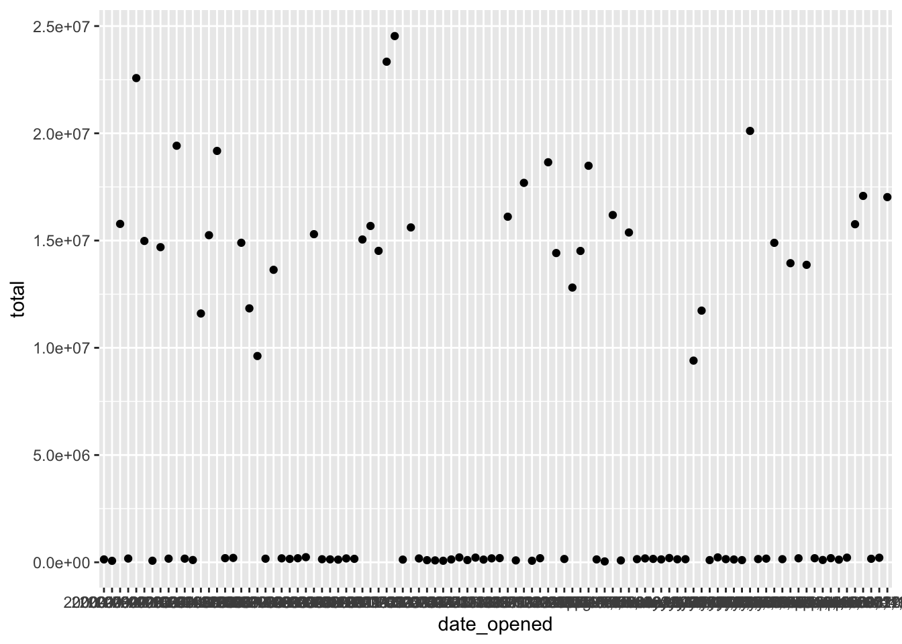
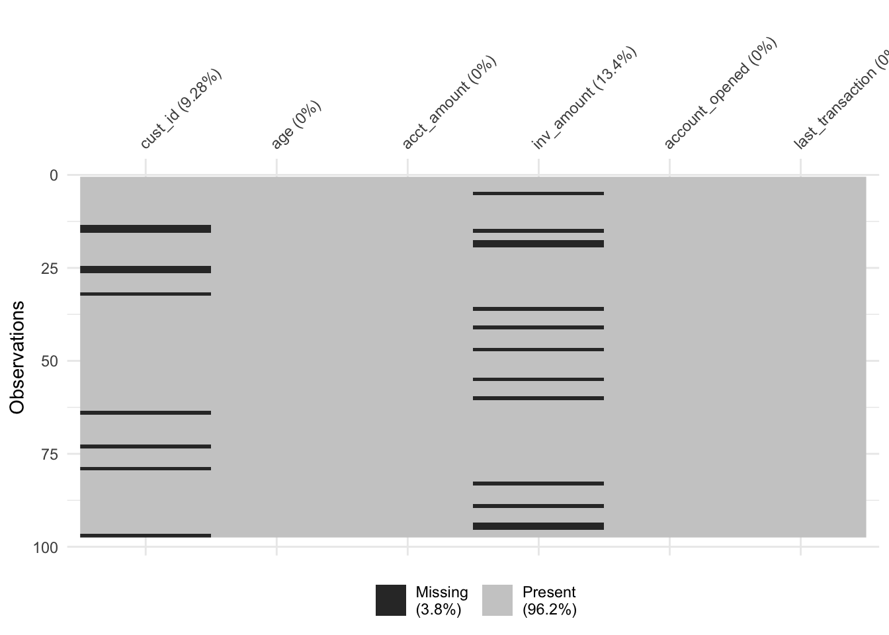
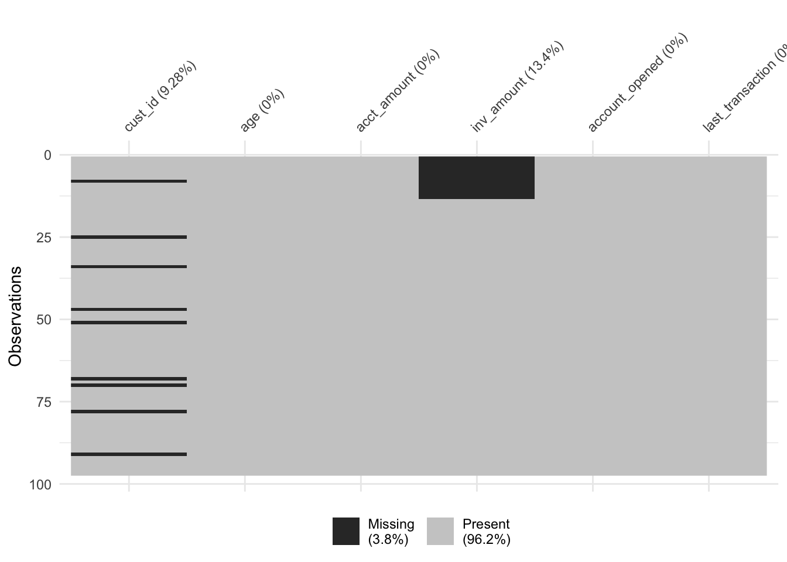

# Cleaning Data in R

<https://learn.datacamp.com/courses/cleaning-data-in-r>


## Common Data Problems

**Converting data types**

Before beginning to analyze any dataset, it's important to take a look at the different types of columns from the. do that by using `glimpse()`:


```r
# Glimpse at bike_share_rides
glimpse(bike_share_rides)
```

```
## Rows: 35,229
## Columns: 10
## $ ride_id         <int> 52797, 54540, 87695, 45619, 70832, 96135, 29928, 83331…
## $ date            <chr> "2017-04-15", "2017-04-19", "2017-04-14", "2017-04-03"…
## $ duration        <chr> "1316.15 minutes", "8.13 minutes", "24.85 minutes", "6…
## $ station_A_id    <dbl> 67, 21, 16, 58, 16, 6, 5, 16, 5, 81, 30, 16, 16, 67, 2…
## $ station_A_name  <chr> "San Francisco Caltrain Station 2  (Townsend St at 4th…
## $ station_B_id    <dbl> 89, 64, 355, 368, 81, 66, 350, 91, 62, 81, 109, 10, 80…
## $ station_B_name  <chr> "Division St at Potrero Ave", "5th St at Brannan St", …
## $ bike_id         <dbl> 1974, 860, 2263, 1417, 507, 75, 388, 239, 1449, 3289, …
## $ user_gender     <chr> "Male", "Male", "Male", "Male", "Male", "Male", "Male"…
## $ user_birth_year <dbl> 1972, 1986, 1993, 1981, 1981, 1988, 1993, 1996, 1993, …
```

```r
# Summary of user_birth_year
summary(bike_share_rides$user_birth_year)
```

```
##    Min. 1st Qu.  Median    Mean 3rd Qu.    Max. 
##    1900    1979    1986    1984    1991    2001
```

The summary statistics of `user_birth_year` don't seem to offer much useful information about the different birth years because the `user_birth_year` column is a `numeric` type and should be converted to a `factor`.

Use `dplyr` and `assertive` packages to convert a column into a factor and assert/confirm whether a column is the type wanted or not.

Use `as.___()` functions to convert objects to a new data type.

Use `assert_is____()` functions to confirm an object's data type.


```r
# Convert user_birth_year to factor: user_birth_year_fct
bike_share_rides <- bike_share_rides %>%
  mutate(user_birth_year_fct = as.factor(user_birth_year))
```

If the `assert` is `TRUE`, nothing will be outputted: 


```r
# Assert user_birth_year_fct is a factor
assert_is_factor(bike_share_rides$user_birth_year_fct)
```


```r
# Summary of user_birth_year_fct
summary(bike_share_rides$user_birth_year_fct)
```

```
## 1900 1902 1923 1931 1938 1939 1941 1942 1943 1945 1946 1947 1948 1949 1950 1951 
##    1    7    2   23    2    1    3   10    4   16    5   24    9   30   37   25 
## 1952 1953 1954 1955 1956 1957 1958 1959 1960 1961 1962 1963 1964 1965 1966 1967 
##   70   49   65   66  112   62  156   99  196  161  256  237  245  349  225  363 
## 1968 1969 1970 1971 1972 1973 1974 1975 1976 1977 1978 1979 1980 1981 1982 1983 
##  365  331  370  548  529  527  563  601  481  541  775  876  825 1016 1056 1262 
## 1984 1985 1986 1987 1988 1989 1990 1991 1992 1993 1994 1995 1996 1997 1998 1999 
## 1157 1318 1606 1672 2135 1872 2062 1582 1703 1498 1476 1185  813  358  365  348 
## 2000 2001 
##  473   30
```

**Trimming strings**

Another common dirty data problem is having extra bits like percent signs or periods in numbers, causing them to be read in as `character`.

Use `str_remove()` to remove `"minutes"` from the `duration` column of `bike_share_rides.` Add this as a new column called `duration_trimmed`.

Convert the `duration_trimmed` column to a numeric type and add this as a new column called `duration_mins`.

`Glimpse` at `bike_share_rides` and `assert` that the `duration_mins` column is `numeric`.


```r
bike_share_rides <- bike_share_rides %>%
  # Remove 'minutes' from duration: duration_trimmed
  mutate(duration_trimmed = str_remove(duration, "minutes"),
         # Convert duration_trimmed to numeric: duration_mins
         duration_mins = as.numeric(duration_trimmed))
```


```r
# Glimpse at bike_share_rides
glimpse(bike_share_rides)
```

```
## Rows: 35,229
## Columns: 13
## $ ride_id             <int> 52797, 54540, 87695, 45619, 70832, 96135, 29928, 8…
## $ date                <chr> "2017-04-15", "2017-04-19", "2017-04-14", "2017-04…
## $ duration            <chr> "1316.15 minutes", "8.13 minutes", "24.85 minutes"…
## $ station_A_id        <dbl> 67, 21, 16, 58, 16, 6, 5, 16, 5, 81, 30, 16, 16, 6…
## $ station_A_name      <chr> "San Francisco Caltrain Station 2  (Townsend St at…
## $ station_B_id        <dbl> 89, 64, 355, 368, 81, 66, 350, 91, 62, 81, 109, 10…
## $ station_B_name      <chr> "Division St at Potrero Ave", "5th St at Brannan S…
## $ bike_id             <dbl> 1974, 860, 2263, 1417, 507, 75, 388, 239, 1449, 32…
## $ user_gender         <chr> "Male", "Male", "Male", "Male", "Male", "Male", "M…
## $ user_birth_year     <dbl> 1972, 1986, 1993, 1981, 1981, 1988, 1993, 1996, 19…
## $ user_birth_year_fct <fct> 1972, 1986, 1993, 1981, 1981, 1988, 1993, 1996, 19…
## $ duration_trimmed    <chr> "1316.15 ", "8.13 ", "24.85 ", "6.35 ", "9.8 ", "1…
## $ duration_mins       <dbl> 1316.15, 8.13, 24.85, 6.35, 9.80, 17.47, 16.52, 14…
```


```r
# Assert duration_mins is numeric
assert_is_numeric(bike_share_rides$duration_mins)
```

For more details, go to the *String Wrangling* section at the bottom of [Transform your data](https://econ380w21.github.io/bpAlNw1Ae7YwY9H3f/working-with-data-in-the-tidyverse.html#transform-your-data) chapter of *Working with Data in the Tidyverse*.

**Range constraints**

<center>**Time range**</center>

Values that are out of range can throw off an analysis, so it's important to catch them early on.

examine the `duration_min` column: Bikes are not allowed to be kept out more than 24 hours/1440 minutes at a time, but issues with some of the bikes caused inaccurate recording of the time they were returned.

Create a three-bin histogram of the `duration_min` column of `bike_share_rides` using `ggplot2` to identify if there is out-of-range data.

Replace the values of `duration_min` that are greater than `1440` minutes (24 hours) with `1440.` Add this to `bike_share_rides` as a new column called `duration_min_const`.

Assert that all values of `duration_min_const` are between `0` and `1440`:


```r
# Create breaks
breaks <- c(min(bike_share_rides$duration_mins), 0, 1440, max(bike_share_rides$duration_mins))

# Create a histogram of duration_min
ggplot(bike_share_rides, aes(duration_mins)) +
  geom_histogram(breaks = breaks)
```



```r
# duration_min_const: replace vals of duration_min > 1440 with 1440
bike_share_rides <- bike_share_rides %>%
  mutate(duration_min_const = replace(duration_mins, duration_mins > 1440, 1440))

# Make sure all values of duration_min_const are between 0 and 1440
assert_all_are_in_closed_range(bike_share_rides$duration_min_const, lower = 0, upper = 1440)
```

<center>**Date range**</center>

Something has gone wrong and there are data with dates from the future, which is way outside of the date range to be working with. To fix this, remove any rides from the dataset that have a date in the future.

Convert the `date` column of `bike_share_rides` from `character` to the `Date` data type.

`Assert` that all values in the `date` column happened sometime in the past and not in the future.


```r
# Convert date to Date type
bike_share_rides <- bike_share_rides %>%
  mutate(date = as.Date(date))

# Make sure all dates are in the past
assert_all_are_in_past(bike_share_rides$date)
```

```
## Warning: Coercing bike_share_rides$date to class 'POSIXct'.
```

Filter `bike_share_rides` to get only the rides from the past or today, and save this as `bike_share_rides_past.`

`Assert` that the dates in `bike_share_rides_past` occurred only in the past.


```r
# Filter for rides that occurred before or on today's date
bike_share_rides_past <- bike_share_rides %>%
  filter(date <= today())

# Make sure all dates from bike_share_rides_past are in the past
assert_all_are_in_past(bike_share_rides_past$date)
```

```
## Warning: Coercing bike_share_rides_past$date to class 'POSIXct'.
```

**Uniqueness constraints**

<center>**Full duplicates**</center>

When multiple rows of a data frame share the same values for all columns, they're full duplicates of each other. Removing duplicates like this is important, since having the same value repeated multiple times can alter summary statistics like the `mean` and `median.`

Get the total number of full duplicates in `bike_share_rides`.

Remove all full duplicates from `bike_share_rides` and save the new data frame as `bike_share_rides_unique`.

Get the total number of full duplicates in the new `bike_share_rides_unique` data frame.


```r
# Count the number of full duplicates
sum(duplicated(bike_share_rides))
```

```
## [1] 0
```

```r
# Remove duplicates
bike_share_rides_unique <- distinct(bike_share_rides)

# Count the full duplicates in bike_share_rides_unique
sum(duplicated(bike_share_rides_unique))
```

```
## [1] 0
```

<center>**Partial duplicates**</center>

Identify any partial duplicates and then practice the most common technique to deal with them, which involves dropping all partial duplicates, keeping only the first.

Remove full and partial duplicates from `bike_share_rides` based on `ride_id` only, keeping all columns. Store this as `bike_share_rides_unique`.


```r
# Remove full and partial duplicates
bike_share_rides_unique <- bike_share_rides %>%
  # Only based on ride_id instead of all cols
  distinct(ride_id, .keep_all = TRUE)

# Find duplicated ride_ids in bike_share_rides_unique
bike_share_rides_unique %>%
  # Count the number of occurrences of each ride_id
  count(ride_id) %>%
  # Filter for rows with a count > 1
  filter(n > 1)
```

```
## # A tibble: 0 × 2
## # … with 2 variables: ride_id <int>, n <int>
```

**Aggregating partial duplicates**

Another way of handling partial duplicates is to compute a summary statistic of the values that differ between partial duplicates, such as `mean`, `median`, `maximum`, or `minimum.` This can come in handy when you're not sure how your data was collected and want an average, or if based on domain knowledge, you'd rather have too high of an estimate than too low of an estimate (or vice versa).


```r
bike_share_rides %>%
  # Group by ride_id and date
  group_by(ride_id, date) %>%
  # Add duration_min_avg column
  mutate(duration_min_avg = mean(duration_mins)) %>%
  # Remove duplicates based on ride_id and date, keep all cols
  distinct(ride_id, date, .keep_all = TRUE) %>%
  # Remove duration_min column
  select(-duration_mins)
```

```
## # A tibble: 35,229 × 14
## # Groups:   ride_id, date [35,229]
##    ride_id date       duration        station_A_id station_A_name   station_B_id
##      <int> <date>     <chr>                  <dbl> <chr>                   <dbl>
##  1   52797 2017-04-15 1316.15 minutes           67 San Francisco C…           89
##  2   54540 2017-04-19 8.13 minutes              21 Montgomery St B…           64
##  3   87695 2017-04-14 24.85 minutes             16 Steuart St at M…          355
##  4   45619 2017-04-03 6.35 minutes              58 Market St at 10…          368
##  5   70832 2017-04-10 9.8 minutes               16 Steuart St at M…           81
##  6   96135 2017-04-18 17.47 minutes              6 The Embarcadero…           66
##  7   29928 2017-04-22 16.52 minutes              5 Powell St BART …          350
##  8   83331 2017-04-11 14.72 minutes             16 Steuart St at M…           91
##  9   72424 2017-04-05 4.12 minutes               5 Powell St BART …           62
## 10   25910 2017-04-20 25.77 minutes             81 Berry St at 4th…           81
## # … with 35,219 more rows, and 8 more variables: station_B_name <chr>,
## #   bike_id <dbl>, user_gender <chr>, user_birth_year <dbl>,
## #   user_birth_year_fct <fct>, duration_trimmed <chr>,
## #   duration_min_const <dbl>, duration_min_avg <dbl>
```

## Categorical and Text Data

**Membership data range**

A categorical data column would sometime have a limited range of observations that can be classified into membership list. Observations that doesn't belong to this membership are outliers, and wouldn't make sense.

`Count` the number of occurrences of each `dest_size` in `sfo_survey`.

`"huge"`, `" Small "`, `"Large "`, and `" Hub"` appear to violate membership constraints.


```r
# Count the number of occurrences of dest_size
sfo_survey %>%
  count(dest_size)
```

```
##   dest_size    n
## 1   Small      1
## 2       Hub    1
## 3       Hub 1756
## 4     Large  143
## 5   Large      1
## 6    Medium  682
## 7     Small  225
```

Use the correct filtering join on `sfo_survey` and `dest_sizes` to get the rows of `sfo_survey` that have a valid `dest_size`:


```r
dest_sizes <- structure(list(dest_size = c("Small", "Medium", "Large", "Hub"
), passengers_per_day = structure(c(1L, 3L, 4L, 2L), .Label = c("0-20K", 
"100K+", "20K-70K", "70K-100K"), class = "factor")), .Names = c("dest_size", 
"passengers_per_day"), row.names = c(NA, -4L), class = "data.frame")
```


```r
# Remove bad dest_size rows
sfo_survey %>% 
  # Join with dest_sizes
  semi_join(dest_sizes, by = "dest_size")%>%
  # Count the number of each dest_size
  count(dest_size)
```

```
##   dest_size    n
## 1       Hub 1756
## 2     Large  143
## 3    Medium  682
## 4     Small  225
```

**Identifying inconsistency**

Sometimes, there are different kinds of inconsistencies that can occur within categories, making it look like a variable has more categories than it should.

Examine the `dest_size` column again as well as the `cleanliness` column and determine what kind of issues, if any, these two categorical variables face. 

Count the number of occurrences of each category of the `dest_size` variable of `sfo_survey`. The categories in `dest_size` have **inconsistent white space**:


```r
# Count dest_size
sfo_survey %>%
  count(dest_size)
```

```
##   dest_size    n
## 1   Small      1
## 2       Hub    1
## 3       Hub 1756
## 4     Large  143
## 5   Large      1
## 6    Medium  682
## 7     Small  225
```

Count the number of occurrences of each category of the `cleanliness` variable of `sfo_survey`. The categories in `cleanliness` have **inconsistent capitalization**.


```r
# Count cleanliness
sfo_survey %>%
  count(cleanliness)
```

```
##      cleanliness    n
## 1        Average  433
## 2          Clean  970
## 3          Dirty    2
## 4 Somewhat clean 1254
## 5 Somewhat dirty   30
## 6           <NA>  120
```

**Correcting inconsistency**

`dest_size` has whitespace inconsistencies and cleanliness has capitalization inconsistencies, use the new tools to fix the inconsistent values in `sfo_survey` instead of removing the data points entirely.

Add a column to `sfo_survey` called `dest_size_trimmed` that contains the values in the `dest_size` column with all leading and trailing whitespace removed.

Add another column called `cleanliness_lower` that contains the values in the `cleanliness` column converted to all lowercase.


```r
# Add new columns to sfo_survey
sfo_survey <- sfo_survey %>%
  # dest_size_trimmed: dest_size without whitespace
  mutate(dest_size_trimmed = str_trim(dest_size),
         # cleanliness_lower: cleanliness converted to lowercase
         cleanliness_lower = str_to_lower(cleanliness))

# Count values of dest_size_trimmed
sfo_survey %>%
  count(dest_size_trimmed)
```

```
##   dest_size_trimmed    n
## 1               Hub 1757
## 2             Large  144
## 3            Medium  682
## 4             Small  226
```

```r
# Count values of cleanliness_lower
sfo_survey %>%
  count(cleanliness_lower)
```

```
##   cleanliness_lower    n
## 1           average  433
## 2             clean  970
## 3             dirty    2
## 4    somewhat clean 1254
## 5    somewhat dirty   30
## 6              <NA>  120
```

**Collapsing categories**

Sometimes, there are observations that have input error that make it slightly different from the group it should belong to. Collapse(merge, or cover the error over with an umbrella group) to simply, fix the variable: 


```r
# Count categories of dest_region
sfo_survey %>%
  count(dest_region)
```

```
##             dest_region   n
## 1                  Asia 260
## 2 Australia/New Zealand  66
## 3         Canada/Mexico 220
## 4 Central/South America  29
## 5               East US 498
## 6                Europe 401
## 7           Middle East  79
## 8            Midwest US 281
## 9               West US 975
```

`"EU"`, `"eur"`, and `"Europ"` need to be collapsed to `"Europe"`.

Create a vector called `europe_categories` containing the three values of `dest_region` that need to be collapsed.

Add a new column to `sfo_survey` called `dest_region_collapsed` that contains the values from the `dest_region` column, except the categories stored in `europe_categories` should be collapsed to Europe.


```r
# Count categories of dest_region
sfo_survey %>%
  count(dest_region)
```

```
##             dest_region   n
## 1                  Asia 260
## 2 Australia/New Zealand  66
## 3         Canada/Mexico 220
## 4 Central/South America  29
## 5               East US 498
## 6                Europe 401
## 7           Middle East  79
## 8            Midwest US 281
## 9               West US 975
```

```r
# Categories to map to Europe
europe_categories <- c("Europ", "eur", "EU")

# Add a new col dest_region_collapsed
sfo_survey %>%
  # Map all categories in europe_categories to Europe
  mutate(dest_region_collapsed = fct_collapse(dest_region, 
                                     Europe = europe_categories)) %>%
  # Count categories of dest_region_collapsed
  count(dest_region_collapsed)
```

```
## Warning: Unknown levels in `f`: Europ, eur, EU
```

```
##   dest_region_collapsed   n
## 1                  Asia 260
## 2 Australia/New Zealand  66
## 3         Canada/Mexico 220
## 4 Central/South America  29
## 5               East US 498
## 6                Europe 401
## 7           Middle East  79
## 8            Midwest US 281
## 9               West US 975
```

For more details, go to the *(How To Collapse/Merge Levels)* section of [Manipulating Factor Variables](https://econ380w21.github.io/bpAlNw1Ae7YwY9H3f/categorical-data-in-the-tidyverse.html#manipulating-factor-variables) chapter of *Categorical Data in the Tidyverse*.

**Detecting inconsistent text data**

Sometimes, in a column, there are inconsistent observations in different formats. 

Filter for rows with phone numbers that contain `"("`, or `")"`. Remember to use `fixed()` when searching for parentheses.


```r
sfo_survey[1:10,] %>%
  filter(str_detect(safety, "safe") | str_detect(safety, "danger"))
```

```
##     id       day          airline destination   dest_region dest_size
## 1 1844    Monday TURKISH AIRLINES    ISTANBUL   Middle East       Hub
## 2 1840    Monday TURKISH AIRLINES    ISTANBUL   Middle East       Hub
## 3 1837    Monday TURKISH AIRLINES    ISTANBUL   Middle East       Hub
## 4 3010 Wednesday         AMERICAN       MIAMI       East US       Hub
## 5 1838    Monday TURKISH AIRLINES    ISTANBUL   Middle East       Hub
## 6 1845    Monday TURKISH AIRLINES    ISTANBUL   Middle East       Hub
## 7 2097    Monday      UNITED INTL MEXICO CITY Canada/Mexico       Hub
## 8 1846    Monday TURKISH AIRLINES    ISTANBUL   Middle East       Hub
##   boarding_area  dept_time wait_min    cleanliness        safety
## 1  Gates 91-102 2018-12-31      315 Somewhat clean Somewhat safe
## 2  Gates 91-102 2018-12-31      165        Average Somewhat safe
## 3  Gates 91-102 2018-12-31      225 Somewhat clean Somewhat safe
## 4   Gates 50-59 2018-12-31       88 Somewhat clean     Very safe
## 5  Gates 91-102 2018-12-31      195 Somewhat clean     Very safe
## 6  Gates 91-102 2018-12-31      135        Average Somewhat safe
## 7  Gates 91-102 2018-12-31      145 Somewhat clean Somewhat safe
## 8  Gates 91-102 2018-12-31      145          Clean Somewhat safe
##         satisfaction dest_size_trimmed cleanliness_lower
## 1 Somewhat satsified               Hub    somewhat clean
## 2 Somewhat satsified               Hub           average
## 3 Somewhat satsified               Hub    somewhat clean
## 4 Somewhat satsified               Hub    somewhat clean
## 5 Somewhat satsified               Hub    somewhat clean
## 6 Somewhat satsified               Hub           average
## 7 Somewhat satsified               Hub    somewhat clean
## 8 Somewhat satsified               Hub             clean
```

For more details, go to the *String Wrangling* section at the bottom of [Transform your data](https://econ380w21.github.io/bpAlNw1Ae7YwY9H3f/working-with-data-in-the-tidyverse.html#transform-your-data) chapter of *Working with Data in the Tidyverse*.

**Replacing and removing**

The `str_remove_all()` function will remove all instances of the string passed to it.


```r
sfo_survey[1:10,] %>%
  mutate(safe_or_not = str_remove_all(safety, "Somewhat")) %>%
  select(airline, safe_or_not)
```

```
##             airline safe_or_not
## 1  TURKISH AIRLINES     Neutral
## 2  TURKISH AIRLINES        safe
## 3  TURKISH AIRLINES        safe
## 4  TURKISH AIRLINES        safe
## 5  TURKISH AIRLINES     Neutral
## 6          AMERICAN   Very safe
## 7  TURKISH AIRLINES   Very safe
## 8  TURKISH AIRLINES        safe
## 9       UNITED INTL        safe
## 10 TURKISH AIRLINES        safe
```

Again, go to the *String Wrangling* section at the bottom of [Transform your data](https://econ380w21.github.io/bpAlNw1Ae7YwY9H3f/working-with-data-in-the-tidyverse.html#transform-your-data)

**Filter/select observations with certain length**

The `str_length()` function takes in a character vector, returns a number for each element that indicates the length of each element.


```r
clean_only <- sfo_survey %>%
  filter(str_length(cleanliness_lower) == 5)

clean_only[1:10,] %>%
  select(airline, cleanliness_lower)
```

```
##             airline cleanliness_lower
## 1  TURKISH AIRLINES             clean
## 2  TURKISH AIRLINES             clean
## 3  TURKISH AIRLINES             clean
## 4  TURKISH AIRLINES             clean
## 5  TURKISH AIRLINES             clean
## 6  TURKISH AIRLINES             clean
## 7    CATHAY PACIFIC             clean
## 8            UNITED             clean
## 9            UNITED             clean
## 10         FRONTIER             clean
```

## Advanced Data Problems

**Date uniformity**

Make sure that the `accounts` dataset doesn't contain any uniformity problems. In this exercise, investigate the `date_opened` column and clean it up so that all the dates are in the same format.

By default, `as.Date()` can't convert `"Month DD, YYYY"` formats: 


```r
as.Date(accounts$date_opened)
```

```
##  [1] "2003-10-19" NA           "2008-07-29" "2005-06-09" "2012-03-31"
##  [6] "2007-06-20" NA           "2019-06-03" "2011-05-07" "2018-04-07"
## [11] "2018-11-16" "2001-04-16" "2005-04-21" "2006-06-13" "2009-01-07"
## [16] "2012-07-07" NA           NA           "2004-05-21" "2001-09-06"
## [21] "2005-04-09" "2009-10-20" "2003-05-16" "2015-10-25" NA          
## [26] NA           NA           "2008-12-27" "2015-11-11" "2009-02-26"
## [31] "2008-12-26" NA           NA           "2005-12-13" NA          
## [36] "2004-12-03" "2016-10-19" NA           "2009-10-05" "2013-07-11"
## [41] "2002-03-24" "2015-10-17" NA           NA           "2019-11-12"
## [46] NA           NA           "2019-10-01" "2000-08-17" "2001-04-11"
## [51] NA           "2016-06-30" NA           NA           "2013-05-23"
## [56] "2017-02-24" NA           "2004-11-02" "2019-03-06" "2018-09-01"
## [61] NA           "2002-12-31" "2013-07-27" "2014-01-10" "2011-12-14"
## [66] NA           "2008-03-01" "2018-05-07" "2017-11-23" NA          
## [71] "2008-09-27" NA           "2008-01-07" NA           "2005-05-11"
## [76] "2003-08-12" NA           NA           NA           "2014-11-25"
## [81] NA           NA           NA           "2008-04-01" NA          
## [86] "2002-10-01" "2011-03-25" "2000-07-11" "2014-10-19" NA          
## [91] "2013-06-20" "2008-01-16" "2016-06-24" NA           NA          
## [96] "2007-04-29" NA           NA
```

For more details, go to the *Date Formats* section of [Utilities](https://econ380w21.github.io/bpAlNw1Ae7YwY9H3f/intermediate-r.html#utilities) chapter of *Intermediate R*.

Convert the dates in the `date_opened` column to the same format using the `formats` vector and store this as a new column called `date_opened_clean`:


```r
# Define the date formats
formats <- c("%Y-%m-%d", "%B %d, %Y")

# Convert dates to the same format
accounts[1:10,] %>%
  mutate(date_opened_clean = parse_date_time(date_opened, formats))
```

```
##          id       date_opened    total date_opened_clean
## 1  A880C79F        2003-10-19   169305        2003-10-19
## 2  BE8222DF  October 05, 2018   107460        2018-10-05
## 3  19F9E113        2008-07-29 15297152        2008-07-29
## 4  A2FE52A3        2005-06-09 14897272        2005-06-09
## 5  F6DC2C08        2012-03-31   124568        2012-03-31
## 6  D2E55799        2007-06-20 13635752        2007-06-20
## 7  53AE87EF December 01, 2017 15375984        2017-12-01
## 8  3E97F253        2019-06-03 14515800        2019-06-03
## 9  4AE79EA1        2011-05-07 23338536        2011-05-07
## 10 2322DFB4        2018-04-07   189524        2018-04-07
```

**Currency uniformity**


Now that dates are in order, correct any unit differences. First, plot the data, there's a group of very high values, and a group of relatively lower values. The bank has two different offices - one in New York, and one in Tokyo, so the accounts managed by the Tokyo office are in Japanese yen instead of U.S.

Create a scatter plot with `date_opened` on the x-axis and `total` on the y-axis:

```r
# Scatter plot of opening date and total amount
accounts %>%
  ggplot(aes(x = date_opened, y = total)) +
  geom_point()
```



Left join `accounts` and `account_offices` by their `id` columns.

Convert the `totals` from the Tokyo office from yen to dollars, and keep the `total` from the New York office in dollars. Store this as a new column called `total_usd`:

```r
# Left join accounts to account_offices by id
accounts[1:10,] %>%
  left_join(account_offices, by = "id") %>%
  
  # Convert totals from the Tokyo office to USD
  mutate(total_usd = ifelse(office == "Tokyo", total / 104, total))
```

```
##          id       date_opened    total   office total_usd
## 1  A880C79F        2003-10-19   169305 New York    169305
## 2  BE8222DF  October 05, 2018   107460 New York    107460
## 3  19F9E113        2008-07-29 15297152    Tokyo    147088
## 4  A2FE52A3        2005-06-09 14897272    Tokyo    143243
## 5  F6DC2C08        2012-03-31   124568 New York    124568
## 6  D2E55799        2007-06-20 13635752    Tokyo    131113
## 7  53AE87EF December 01, 2017 15375984    Tokyo    147846
## 8  3E97F253        2019-06-03 14515800    Tokyo    139575
## 9  4AE79EA1        2011-05-07 23338536    Tokyo    224409
## 10 2322DFB4        2018-04-07   189524 New York    189524
```

**Cross field validation**

Cross field validation basically means cross-checking/comparing with other columns to make sure the compared column values make sense.


<center>**Validating totals**</center>

There are three different funds that account holders can store their money in. In this exercise, validate whether the total amount in each account is equal to the sum of the amount in `fund_A`, `fund_B`, and `fund_C`.

Create a new column called `theoretical_total` that contains the sum of the amounts in each fund.

Find the accounts where the `total` doesn't match the `theoretical_total`.


```r
# Find invalid totals
accounts_funds %>%
  # theoretical_total: sum of the three funds
  mutate(theoretical_total = fund_A + fund_B + fund_C) %>%
  # Find accounts where total doesn't match theoretical_total
  filter(theoretical_total != total)
```

```
##         id date_opened  total fund_A fund_B fund_C acct_age theoretical_total
## 1 D5EB0F00  2001-04-16 130920  69487  48681  56408       19            174576
## 2 92C237C6  2005-12-13  85362  72556  21739  19537       15            113832
## 3 0E5B69F5  2018-05-07 134488  88475  44383  46475        2            179333
```

**Validating age**

Now that some inconsistencies in the `total` amounts been found, there may also be inconsistencies in the `acct_age` column, maybe these inconsistencies are related. Validate the age of each account and see if rows with inconsistent `acct_age`s are the same ones that had inconsistent `total`s.

Create a new column called `theoretical_age` that contains the age of each account based on the `date_opened.`

Find the accounts where the `acct_age` doesn't match the `theoretical_age.`


```r
# Find invalid acct_age
accounts_funds %>%
  # theoretical_age: age of acct based on date_opened
  mutate(theoretical_age = floor(as.numeric(date_opened %--% today(), "years"))) %>%
  # Filter for rows where acct_age is different from theoretical_age
  filter(acct_age != theoretical_age)
```

```
##          id date_opened  total fund_A fund_B fund_C acct_age theoretical_age
## 1  A880C79F  2003-10-19 169305  85018  75580   8707       17              18
## 2  BE8222DF  2018-10-05 107460  64784  35194   7482        2               3
## 3  19F9E113  2008-07-29 147088  64029  15300  67759       12              13
## 4  A2FE52A3  2005-06-09 143243  63466  54053  25724       15              16
## 5  F6DC2C08  2012-03-31 124568  21156  47935  55477        8              10
## 6  D2E55799  2007-06-20 131113  79241  26800  25072       13              14
## 7  53AE87EF  2017-12-01 147846  38450  29185  80211        3               4
## 8  3E97F253  2019-06-03 139575  11045  65907  62623        1               2
## 9  4AE79EA1  2011-05-07 224409  68394  80418  75597        9              10
## 10 2322DFB4  2018-04-07 189524  66964  52238  70322        2               4
## 11 645335B2  2018-11-16 154001  68691  56400  28910        2               3
## 12 D5EB0F00  2001-04-16 130920  69487  48681  56408       19              20
## 13 1EB593F7  2005-04-21 191989  75388  84199  32402       15              16
## 14 DDBA03D9  2006-06-13  92473  32931  22162  37380       14              15
## 15 40E4A2F4  2009-01-07 180547  82564  68210  29773       12              13
## 16 39132EEA  2012-07-07 150115  26358  74286  49471        8               9
## 17 387F8E4D  2011-01-03  90410   7520  67142  15748       10              11
## 18 11C3C3C0  2017-12-24 180003  84295  31591  64117        2               4
## 19 C2FC91E1  2004-05-21 105722  25398  24075  56249       16              17
## 20 FB8F01C1  2001-09-06 217068  69738  86768  60562       19              20
## 21 0128D2D0  2005-04-09 184421  82221  60149  42051       15              17
## 22 BE6E4B3F  2009-10-20 150769  49607  55417  45745       11              12
## 23 7C6E2ECC  2003-05-16 169814  82093  62756  24965       17              18
## 24 02E63545  2015-10-25 125117  50287  23342  51488        5               6
## 25 4399C98B  2001-05-19 130421  58177  43912  28332       19              20
## 26 98F4CF0F  2014-05-27 143211  84645   7088  51478        6               7
## 27 247222A6  2015-05-26 150372  69104  63369  17899        5               6
## 28 420985EE  2008-12-27 123125  59390  27890  35845       12              13
## 29 0E3903BA  2015-11-11 182668  47236  87437  47995        5               6
## 30 64EF994F  2009-02-26 161141  89269  25939  45933       11              13
## 31 CCF84EDB  2008-12-26 136128  33405  89016  13707       12              13
## 32 51C21705  2016-04-22 155684  53542  38234  63908        4               5
## 33 C868C6AD  2000-01-31 112818  17876  15057  79885       21              22
## 34 92C237C6  2005-12-13  85362  72556  21739  19537       15              16
## 35 9ECEADB2  2018-05-17 146153  40675  46482  58996        2               3
## 36 DF0AFE50  2004-12-03 146635  67373  63443  15819       16              17
## 37 5CD605B3  2016-10-19  87921   8474  50284  29163        4               5
## 38 402839E2  2019-09-14 163416  59213  23460  80743        1               2
## 39 78286CE7  2009-10-05 144704  72495  38450  33759       11              12
## 40 168E071B  2013-07-11  87826  21642  42937  23247        7               8
## 41 466CCDAA  2002-03-24 144051  19756  80182  44113       18              20
## 42 8DE1ECB9  2015-10-17 217975  67105  72907  77963        5               6
## 43 E19FE6B5  2009-06-06 101936  39942  38580  23414       11              12
## 44 1240D39C  2011-09-07 151556  18835  46135  86586        9              10
## 45 A7BFAA72  2019-11-12 133790  56001  54885  22904        1               2
## 46 C3D24436  2002-05-24 101584  58434  21069  22081       18              19
## 47 FAD92F0F  2007-09-13 164241  70211  73984  20046       13              14
## 48 236A1D51  2019-10-01 177759  20886  80883  75990        1               2
## 49 A6DDDC4C  2000-08-17  67962   5970  20088  41904       20              21
## 50 DDFD0B3D  2001-04-11 151696  30596  84390  36710       19              20
## 51 D13375E9  2005-11-01 134083  28545  37537  68001       15              16
## 52 AC50B796  2016-06-30 154916  54451  35906  64559        4               5
## 53 290319FD  2005-05-27 170178  54341  32764  83073       15              16
## 54 FC71925A  2006-11-02 186281  89127  43356  53798       14              15
## 55 7B0F3685  2013-05-23 179102  81321  18106  79675        7               8
## 56 BE411172  2017-02-24 170096  86735  56580  26781        3               5
## 57 58066E39  2015-09-16 163708  59004  16987  87717        5               6
## 58 EA7FF83A  2004-11-02 111526  86856  19406   5264       15              17
## 59 14A2DDB7  2019-03-06 123163  49666  25407  48090        1               3
## 60 305EEAA8  2018-09-01 138632  20307  35028  83297        2               3
## 61 8F25E54C  2008-11-24 189126  72037  62513  54576       12              13
## 62 19DD73C6  2002-12-31 141275  72872  51219  17184       18              19
## 63 ACB8E6AF  2013-07-27  71359  10203  51163   9993        7               8
## 64 91BFCC40  2014-01-10 132859  67405   7399  58055        7               8
## 65 86ACAF81  2011-12-14 235901  79599  79291  77011        9              10
## 66 77E85C14  2009-11-20 133348  20954  33018  79376       11              12
## 67 C5C6B79D  2008-03-01 188424  61972  69266  57186       12              14
## 68 0E5B69F5  2018-05-07 134488  88475  44383  46475        2               3
## 69 5275B518  2017-11-23  71665  16114  35691  19860        3               4
## 70 17217048  2001-05-25 193377  45365  58558  89454       19              20
## 71 E7496A7F  2008-09-27 142669   8615  72841  61213       12              13
## 72 41BBB7B4  2005-02-22 144229  26449  83938  33842       15              17
## 73 F6C7ABA1  2008-01-07 183440  82468  73281  27691       13              14
## 74 E699DF01  2008-02-17 199603  84788  47808  67007       12              14
## 75 BACA7378  2005-05-11 204271  87254  57043  59974       15              16
## 76 84A4302F  2003-08-12 186737  86632  33506  66599       17              18
## 77 F8A78C27  2006-04-05  41164   7560  21040  12564       14              16
## 78 8BADDF6A  2010-12-31 158203  25477  43902  88824       10              11
## 79 9FB57E68  2017-09-01 216352  86665  77117  52570        3               4
## 80 5C98E8F5  2014-11-25 103200  28990  24986  49224        6               7
## 81 6BB53C2A  2016-12-03 146394  29561  29023  87810        4               5
## 82 E23F2505  2017-10-15 121614  59013  39086  23515        3               4
## 83 0C121914  2017-06-21 227729  86625  79950  61154        3               4
## 84 3627E08A  2008-04-01 238104  60475  89011  88618       11              14
## 85 A94493B3  2009-08-01  85975  48482   7054  30439       11              12
## 86 0682E9DE  2002-10-01  72832  15809  15617  41406       18              19
## 87 49931170  2011-03-25 139614  83035  22239  34340        9              11
## 88 A154F63B  2000-07-11 133800  42648  16464  74688       20              21
## 89 3690CCED  2014-10-19 226595  70260  84337  71998        6               7
## 90 48F5E6D8  2020-02-16 135435  29123  23204  83108        0               2
## 91 515FAD84  2013-06-20  98190   6452  60014  31724        7               8
## 92 59794264  2008-01-16 157964  68869  32999  56096       13              14
## 93 2038185B  2016-06-24 194662  20591  89990  84081        4               5
## 94 65EAC615  2004-02-20 140191  20108  46764  73319       16              18
## 95 6C7509C9  2000-09-16 212089  58861  76975  76253       20              21
## 96 BD969A9D  2007-04-29 167238  10234  83183  73821       13              14
## 97 B0CDCE3D  2014-05-28 145240  62549  48606  34085        6               7
## 98 33A7F03E  2007-10-14 191839  80542  87909  23388       13              14
```

**Visualizing missing data**


Dealing with missing data is one of the most common tasks in data science. There are a variety of types of missingness, as well as a variety of types of solutions to missing data.

A new version of the accounts data frame containing data on the `amount held` and `amount invested` for new and existing customers. However, there are rows with missing `inv_amount` values.

Visualize the missing values in `accounts` by column using `vis_miss()` from the `visdat` package.


```r
# Visualize the missing values by column
vis_miss(accounts_inv)
```



Most customers below 25 do not have investment accounts yet, and suspect it could be driving the missingness. 


```r
accounts_inv %>%
  # missing_inv: Is inv_amount missing?
  mutate(missing_inv = is.na(inv_amount)) %>%
  # Group by missing_inv
  group_by(missing_inv) %>%
  # Calculate mean age for each missing_inv group
  summarize(avg_age = mean(age))
```

```
## # A tibble: 2 × 2
##   missing_inv avg_age
##   <lgl>         <dbl>
## 1 FALSE          43.6
## 2 TRUE           21.8
```

Since the average age for `TRUE` `missing_inv` is `22` and the average age for `FALSE` `missing_inv` is `44`, it is likely that the `inv_amount` variable is missing mostly in young customers.


```r
# Sort by age and visualize missing vals
accounts_inv %>%
  arrange(age) %>%
  vis_miss()
```



## Record Linkage

`Damerau-Levenshtein` `distance` is used to identify how similar two strings are. As a reminder, `Damerau-Levenshtein` `distance` is the minimum number of steps needed to get from String A to String B, using these operations:

*Insertion* of a new character.

*Deletion* of an existing character.

*Substitution* of an existing character.

*Transposition* of two existing consecutive characters.

Use the `stringdist` package to compute string distances using various methods.


```r
# Calculate Damerau-Levenshtein distance
stringdist("las angelos", "los angeles", method = "dl")
```

```
## [1] 2
```

LCS (Longest Common Subsequence) only considers *Insertion* and *Deletion*.

```r
# Calculate LCS distance
stringdist("las angelos", "los angeles", method = "lcs")
```

```
## [1] 4
```


```r
# Calculate Jaccard distance
stringdist("las angelos", "los angeles", method = "jaccard")
```

```
## [1] 0
```

**Fixing typos with string distance**


`zagat`, is a set of restaurants in New York, Los Angeles, Atlanta, San Francisco, and Las Vegas. The data is from Zagat, a company that collects restaurant reviews, and includes the restaurant names, addresses, phone numbers, as well as other restaurant information.

The `city` column contains the name of the city that the restaurant is located in. However, there are a number of typos throughout the column. Map each `city` to one of the five correctly-spelled cities contained in the `cities` data frame.

Left join `zagat` and `cities` based on string distance using the `city` and `city_actual` columns.

`stringdist_left_join` function from the `fuzzyjoin` package that allows you to do a `stringdist` left join.


```r
# Count the number of each city variation
zagat[1:10,] %>%
  count(city)
```

```
##           city n
## 1 llos angeles 1
## 2   lo angeles 2
## 3 los anegeles 1
## 4  los angeles 6
```


```r
# Join and look at results
zagat[1:10,] %>%
  # Left join based on stringdist using city and city_actual cols
  stringdist_left_join(cities, by = c("city" = "city_actual")) %>%
  # Select the name, city, and city_actual cols
  select(name, city, city_actual)
```

```
##                         name         city city_actual
## 1              apple pan the llos angeles los angeles
## 2                asahi ramen  los angeles los angeles
## 3                 baja fresh  los angeles los angeles
## 4              belvedere the  los angeles los angeles
## 5            benita's frites   lo angeles los angeles
## 6                  bernard's  los angeles los angeles
## 7                  bistro 45   lo angeles los angeles
## 8       brighton coffee shop  los angeles los angeles
## 9  bristol farms market cafe los anegeles los angeles
## 10                  cafe'50s  los angeles los angeles
```

**Record linkage**

record linkage is the act of linking data from different sources regarding the same entity. But unlike joins, record linkage does not require exact matches between different pairs of data, and instead can find close matches using string similarity. This is why record linkage is effective when there are no common unique keys between the data sources you can rely upon when linking data sources such as a unique identifier.

**Pair blocking**


Generate all possible pairs, and then use newly-cleaned `city` column as a blocking variable. A blocking variable is helpful when the dataset is too big and you don't want to compare/match all the possible pairs with each every one of the observations. 


```r
# Generate pairs with same city
pair_blocking(zagat, fodors, blocking_var = "city")
```

```
## Simple blocking
##   Blocking variable(s): city
##   First data set:  310 records
##   Second data set: 533 records
##   Total number of pairs: 27 694 pairs
## 
## ldat with 27 694 rows and 2 columns
##         x   y
## 1       2   1
## 2       2   2
## 3       2   3
## 4       2   4
## 5       2   5
## 6       2   6
## 7       2   7
## 8       2   8
## 9       2   9
## 10      2  10
## :       :   :
## 27685 307 524
## 27686 307 525
## 27687 307 526
## 27688 307 527
## 27689 307 528
## 27690 307 529
## 27691 307 530
## 27692 307 531
## 27693 307 532
## 27694 307 533
```

**Comparing pairs**

Compare pairs by `name`, `phone`, and `addr` using `jaro_winkler()`.

`compare_pairs()` can take in a `character` vector of column names as the `by` argument.


```r
# Generate pairs
pair_blocking(zagat, fodors, blocking_var = "city") %>%
  # Compare pairs by name, phone, addr
  compare_pairs(by = c("name", "phone", "addr"),
                default_comparator = jaro_winkler())
```

```
## Compare
##   By: name, phone, addr
## 
## Simple blocking
##   Blocking variable(s): city
##   First data set:  310 records
##   Second data set: 533 records
##   Total number of pairs: 27 694 pairs
## 
## ldat with 27 694 rows and 5 columns
##         x   y      name     phone      addr
## 1       2   1 0.4959307 0.7152778 0.5948270
## 2       2   2 0.6197391 0.6269841 0.6849415
## 3       2   3 0.4737762 0.8222222 0.5754386
## 4       2   4 0.4131313 0.6111111 0.6435407
## 5       2   5 0.6026936 0.6527778 0.6132376
## 6       2   6 0.5819625 0.7361111 0.6108862
## 7       2   7 0.4242424 0.6111111 0.6207899
## 8       2   8 0.4303030 0.5555556 0.5566188
## 9       2   9 0.4559885 0.6666667 0.6283892
## 10      2  10 0.5798461 0.7152778 0.4885965
## :       :   :         :         :         :
## 27685 307 524 0.6309524 0.7361111 0.6574074
## 27686 307 525 0.3683473 0.6666667 0.6650327
## 27687 307 526 0.5306878 0.7962963 0.4888889
## 27688 307 527 0.4841270 0.7407407 0.6499183
## 27689 307 528 0.4285714 0.6666667 0.5882173
## 27690 307 529 0.5026455 0.6111111 0.6357143
## 27691 307 530 0.4087302 0.6666667 0.5470085
## 27692 307 531 0.5591479 0.7407407 0.8141026
## 27693 307 532 0.4226190 0.7222222 0.5004274
## 27694 307 533 0.4005602 0.6746032 0.6119048
```


