# Dummy Variables Part 2

[Solutions](https://moodle.lawrence.edu/pluginfile.php/690617/mod_resource/content/4/16-DummyVariables2-SOLN.html)

<style>
.textSoln {
  color: red;
}
</style>


<!-- This defines a LaTeX command "betahat" so that we can type `\betahat{1}` instead of `\hat{\beta}_1`. -->

\[
\newcommand{\betahat}[1]{\hat{\beta}_{#1}}
\]


This chapter uses the data in `HousePriceDummies.csv` with price of the house in dollars (`price`), size of the hose in square feet (`size`), number of bathrooms (`baths`), and number of bedrooms (`beds`).

This is the second chapter covering dummy variables. From this chapter you should learn about intercept dummies that allow the average $y$ value to differ by group by the same amount for all values of the other explanatory variables. Intercept dummies are the most common use of dummy variables. You'll create an intercept dummy from a numerical variable (`baths`) that only has two possible values, so while you're working with a dummy variable, you're actually just working with regression models you should already understand. THis hopefully helps you better understand how to work with all dummy variables, include those based on qualitative information.You should also learn about slope dummies that allow the slope to vary by group. 

During a regular term we might work through this together in class over a few class meetings. You'd work through it on your own, but I'd be available in the classroom if you got stuck to help you get unstuck.  This term I will post solutions in Moodle to help you get unstuck if needed. You are free to use those solutions as much as you want. The bare minimum you need to do is copy what I have in the solutions and paste it into this file. Doing that will not be considered cheating (in some classes that would be considered cheating, so always make sure you know whether using posted solutions is ok or not). If all you do is copy the solutions, however, you clearly won't come away with a better understanding of the material, so I strongly encourage you to try to work through the questions on your own before looking at the solutions. But when you're stuck or just can't figure out what I'm asking, use the solutions rather than wasting time. 

Wherever you see `qCnt()` in the RMD file you'll see a number in the HTML output. `qCnt()` is a counter (defined in the code chunk above) that is putting what are essentially question numbers in the HTML output. This makes it easier to discuss with others because we can refer to the different questions by number. 


## Size only

**1)** In this first code chunk, first estimate the simple linear regression model of price on size and store it in `modelS` (that's "model" and a capital letter "S" for "Size"). Then display `modelS` using pander. Next, add a variable `yHatS` to the `mydata`data frame with the predicted price from `modelS`. Yes, R has a `fitted()` function to do this for you, but I want you to calculate it manually using: 

$$
\hat{y} =  \betahat{0} + \betahat{1}size
$$

Finally, create a scatter plot of the data using the number of bathrooms (`baths`) as a factor for the color (we need `factor()` so it treats `baths` as distinct integers, 1 and 2, instead of a continuous variable that could have values like 1.234). We also include `yHatS` as a scatterplot and as a line (also using `yHatS`). Make sure you understand why all of the `yHatS` points are on the `yHatS` line. Throughout this chapter we'll use an "x" symbol (ggplot's `shape=4`) to display the data and dots (i.e., filled-in circles, ggplot's `shape=19`, which is also it's default) to display predicted prices (i.e., `yHatS`).

I filled this first one in for you. 


```r
modelS <- lm(price~size,data=mydata)
pander(summary(modelS))
```


---------------------------------------------------------------
     &nbsp;        Estimate   Std. Error   t value   Pr(>|t|)  
----------------- ---------- ------------ --------- -----------
 **(Intercept)**    49174       15291       3.216    0.001502  

    **size**        154.4       7.645       20.19    1.826e-51 
---------------------------------------------------------------


--------------------------------------------------------------
 Observations   Residual Std. Error   $R^2$    Adjusted $R^2$ 
-------------- --------------------- -------- ----------------
     216               55363          0.6558       0.6542     
--------------------------------------------------------------

Table: Fitting linear model: price ~ size

```r
mydata$yHatS <- coef(modelS)["(Intercept)"] + coef(modelS)["size"] * mydata$size
ggplot(mydata) + 
  geom_point(aes(y=price,x=size,col=factor(baths)),shape=4) +
  geom_point(aes(y=yHatS,x=size,col=factor(baths))) +
  geom_line(aes(y=yHatS,x=size),col="black")
```

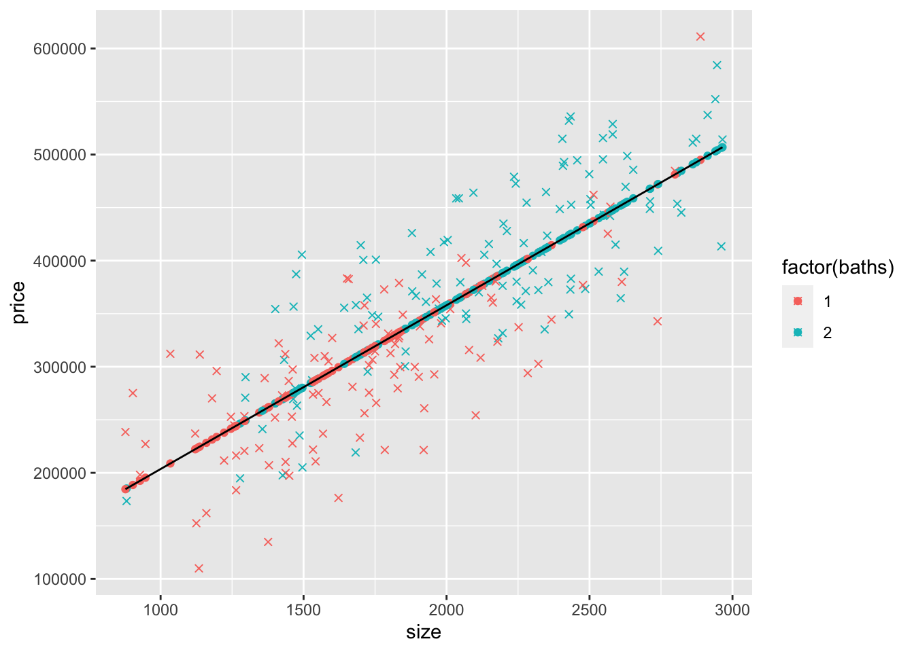


**2)** A big part of our focus in this chapter is the regression lines, so let's be more explicit about plotting the line. The line we plotted above used `geom_line(aes(y=yHatS,x=size))`. We could plot this same line using `geom_smooth`, but later we're going to plot lines that don't work easily with `geom_smooth`. Instead, we're going to use use [`geom_abline()` to plot a line using its intercept and slope](https://ggplot2.tidyverse.org/reference/geom_abline.html). Recall that `yHatS` is:
$$
\hat{y} =  \betahat{0} + \betahat{1}size
$$
so we need to use $\betahat{0}=$ 49173.68 for `geom_abline`'s `intercept` argument and $\betahat{1}=$ 154.37 for `geom_abline`'s `slope` argument. We'll also expand the axes limits so we can see the y intercepts; to do this, we'll include:

`scale_x_continuous(expand = c(0, 0),limits = c(0, max(mydata$size)*1.02),breaks = seq(0,max(mydata$size)*1.02,500))`

and

`scale_y_continuous(expand = c(0, 0),limits = c(0, max(mydata$price)*1.02), breaks = seq(0,max(mydata$price)*1.02,50000))`


<div class="textSoln">
***

```r
ggplot(mydata) +
  scale_x_continuous(expand = c(0, 0),limits = c(0, max(mydata$size)*1.02),
                     breaks = seq(0,max(mydata$size)*1.02,500)) + 
  scale_y_continuous(expand = c(0, 0),limits = c(0, max(mydata$price)*1.02), 
                     breaks = seq(0,max(mydata$price)*1.02,50000)) +  
  geom_point(aes(y=price,x=size,col=factor(baths)),shape=4) +
  geom_point(aes(y=yHatS,x=size,col=factor(baths))) +
  geom_abline(intercept = coef(modelS)["(Intercept)"], 
              slope = coef(modelS)["size"],col="black")
```

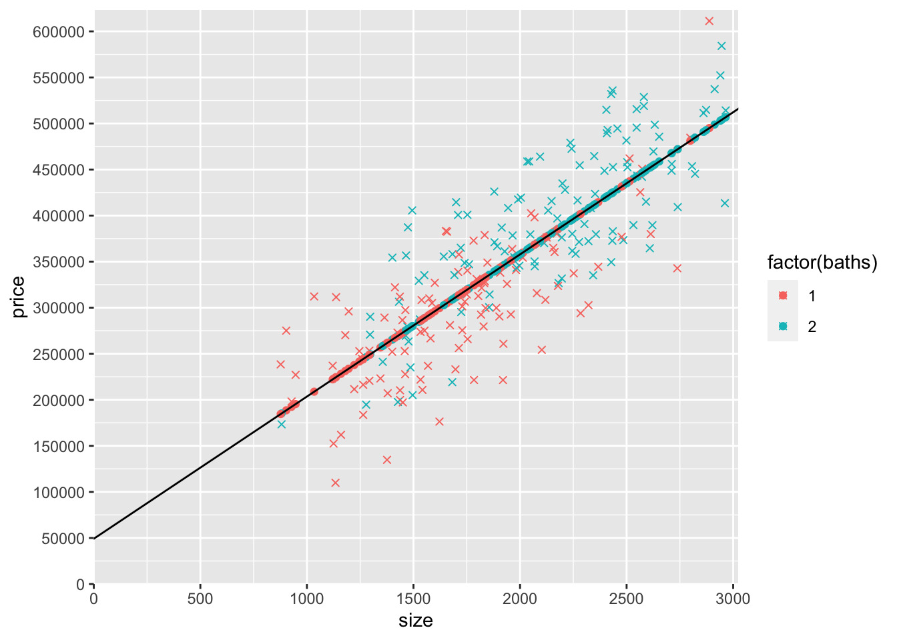
</div>
***


**3)** The slope of `yHatS` is the effect of size (of an additional $ft^2$) on the predicted price from the model that only controls for size. What do you think will happen to the effect of size on the predicted price when we also control for baths?

<div class="textSoln">
***
Controlling for the number of bathrooms (baths) should reduce the effect of size on the predicted price. Assuming that more bathrooms are associated with a higher price and that higher size is predicted when there are more bathrooms (i.e., houses with more bathrooms tend to be larger), leaving the number of bathrooms out of the model causes omitted variable bias (a violation of the ZCM assumption, MLR.4) that makes it look like size has a larger effect on price than it really does when baths is not controlled for.

Note that omitted variable bias doesn’t always cause the coefficient to be larger (i.e., it could cause it to be smaller). In this case it’s larger because baths, size, and price are all positively correlated.

</div>
***


## Number of bathrooms and size


**4)** Now add the number of bathrooms (`baths`) as a variable to the regression (in addition to size) and store the model as `modelSB` ("model" with "S" for size and "B" for baths). Display the output using pander. Add a variable `yHatSB` to `mydata` with the predicted prices from this model. Remember that for this model (the "SB" model that includes both `size` and `baths`), predicted prices are given by:
$$
\hat{y} =  \betahat{0} + \betahat{1}size + \betahat{2}baths
$$


<div class="textSoln">
***

```r
## Estimate regression
modelSB <- lm(price~size+baths,data=mydata)
pander(summary(modelSB))
```


------------------------------------------------------------------
     &nbsp;        Estimate   Std. Error   t value     Pr(>|t|)   
----------------- ---------- ------------ --------- --------------
 **(Intercept)**    20004       15384        1.3        0.1949    

    **size**        136.3       7.944       17.16     5.014e-42   

    **baths**       42005        7841       5.357    0.0000002187 
------------------------------------------------------------------


--------------------------------------------------------------
 Observations   Residual Std. Error   $R^2$    Adjusted $R^2$ 
-------------- --------------------- -------- ----------------
     216               52094          0.6967       0.6938     
--------------------------------------------------------------

Table: Fitting linear model: price ~ size + baths

```r
## Store yHat for this model with size and baths
mydata$yHatSB <- coef(modelSB)["(Intercept)"] + 
                  coef(modelSB)["size"] * mydata$size + 
                  coef(modelSB)["baths"] * mydata$baths
```

</div>
***


**5)** Now let's add `yHatSB` to the graph as a scatterplot. Copy the last graph you made above, remove the `geom_point()` of `yHatS`, and add a `geom_point()` of `yHatSB`. Make the color "orange" for all the `yHatSB` points (i.e., the new `geom_point()` should be this: `geom_point(data=mydata,aes(y=yHatSB,x=size),col="orange")`).


<div class="textSoln">
***

```r
ggplot(mydata) +
  scale_x_continuous(expand = c(0, 0),limits = c(0, max(mydata$size)*1.02),
                     breaks = seq(0,max(mydata$size)*1.02,500)) + 
  scale_y_continuous(expand = c(0, 0),limits = c(0, max(mydata$price)*1.02), 
                     breaks = seq(0,max(mydata$price)*1.02,50000)) +  
  geom_point(aes(y=price,x=size,col=factor(baths)),shape=4) +
  geom_point(aes(y=yHatS,x=size,col=factor(baths))) +
  geom_abline(intercept = coef(modelS)["(Intercept)"], 
              slope = coef(modelS)["size"],col="black")  + 
  geom_point(data=mydata,aes(y=yHatSB,x=size),col="orange")
```

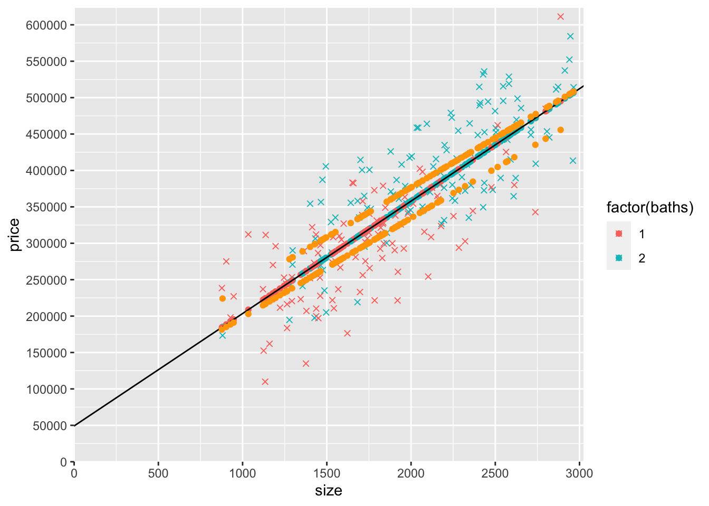
</div>
***


**6)** It looks like there are two upward-sloping parallel rows of `yHatSB` predicted prices. What accounts for the general upward slope of the `yHatSB` predicted prices? Why are there two rows (try looking at a `count()` of `baths` to help you answer this part of the question)? 


<div class="textSoln">
***
The general upward slope of the yHatSB predicted prices is from the relationship of price with size. Because yHatSB is the predicted price controlling for both size and baths but we are graphing price (and predicted price) against size only, the predicted points are not a straight line. Houses with more baths have a higher predicted price. The yHatSB predicted prices are in two rows because there are only two different values of baths, 1 and 2.


```r
mydata %>% count(baths)
```

```
##   baths   n
## 1     1 102
## 2     2 114
```
</div>
***


**7)** Look at the graph you just made. Notice that the `yHatS` line doesn't go straight through the middle of the two rows of `yHatSB` predicted prices.  What is the slope of the yHatS line (the answer is one of the coefficients estimated above)? What is the slope of the two rows of yHatSB predicted prices (the answer is a coefficient estimated above)? Which slope is steeper? What accounts for the difference between these different slopes?


<div class="textSoln">
***
The `yHatS` line has a slope of about 154.37 ft2 (the coefficient on size from the regression of price on size, i.e., modelS). The rows of `yHatSB` predicted prices have a slope of about 136.32 ft2 (the coefficient on size from the regression of price on size and baths, i.e., modelSB).

The `yHatS` line has a steeper slope than the rows of `yHatSB` predicted prices because the estimated effect of size on price is larger from the `modelS` that only controls for size than from the `modelSB` that also controls for baths. 

That slope is also less steep because size and the number of bathrooms positively affect price, and size and the number of bathrooms are themselves positively correlated (i.e., larger houses tend to have more bathrooms).

</div>
***


**8)** How far apart vertically in the y direction (the price direction) are the two rows of `yHatSB` predicted prices? Why?


<div class="textSoln">
***
The higher row of `yHatSB` predicted prices are about $136.32 higher. This is the estimated effect of an additional bathroom on price (from the regression of price on size and baths).  The lower and upper rows are for 1 and 2 bathroom houses consecutively.

</div>
***


**9)** Copy the code from the previous graph and then do the following: 
Using only the coefficients from `modelSB` and the size variable (and simple arithmetic), generate a variable name `yHatSB1` that when you plot it, replaces the **lower row** of `yHatSB` predicted price points. Make sure that these points are only created for observations with 1 bathroom and are `NA` for other observation (I'd use `ifelse()` for `baths==1`). Add these to the graph as `geom_point()` and make these dots red. Also add a `geom_abline()` that goes through this row of dots and make this line red.

Also using only the coefficients from `modelSB` and the size variable (and simple arithmetic), generate a variable name `yHatSB2` that when you plot it, replaces the **upper row** of `yHatSB` predicted price points. Make sure that these points are only created for observations with 2 bathrooms and are `NA` for other observation (I'd use `ifelse()` for `baths==2`). Add these to the graph as `geom_point()` and make these dots blue. Also add a `geom_abline()` that goes through this row of dots and make this line blue.

In addition, remove the orange `yHatSB` points you added before (because you've replaced them with red points and blue points).

In mine, I also labeled the y-intercepts of the three lines (the black line that connects the `yHatS` points, the red line that connects the `yHatSB1` points, and the blue line that connects the `yHatSB2` points). Don't waste much time trying to figure this out, but you should understand how the intercepts correspond with coefficients from the models. 


<div class="textSoln">
***

```r
mydata$yHatSB1 <- ifelse(mydata$baths == 1, coef(modelSB)["(Intercept)"] + 
  coef(modelSB)["baths"]*1 + 
  coef(modelSB)["size"]*mydata$size, 
  NA)

mydata$yHatSB2 <- ifelse(mydata$baths == 2, coef(modelSB)["(Intercept)"] + 
  coef(modelSB)["baths"]*2 + 
  coef(modelSB)["size"]*mydata$size,
  NA)

## These labels the yAxis with the 3 y-intercept values, plus 0 and values from 200k to 600k in steps of 100k
yLabels <- c(0,unname(c(round(coef(modelS)[1],0),round(coef(modelSB)["(Intercept)"] + coef(modelSB)["baths"]*1,0),round(coef(modelSB)["(Intercept)"] + coef(modelSB)["baths"]*2,0))),seq(200000,600000,100000))

ggplot(mydata) +
  scale_x_continuous(expand = c(0, 0),
                     limits = c(0, max(mydata$size)*1.02),
                     breaks = seq(0,max(mydata$size)*1.02,500)) + 
  scale_y_continuous(expand = c(0, 0),
                     limits = c(0, max(mydata$price)*1.02), 
                     breaks = yLabels) +  
  geom_point(aes(y=price,x=size,col=factor(baths)),shape=4) +
  geom_abline(intercept = coef(modelS)["(Intercept)"], 
              slope = coef(modelS)["size"],col="black")  + 
  geom_point(data=mydata,aes(y=yHatS,x=size,col=factor(baths))) +
  geom_point(data=mydata,aes(y=yHatSB1,x=size),col="red") +
  geom_point(data=mydata,aes(y=yHatSB2,x=size),col="blue") +
  geom_abline(intercept = coef(modelSB)["(Intercept)"] 
              + coef(modelSB)["baths"]*1, 
              slope = coef(modelSB)["size"],col="red")  + 
  geom_abline(intercept = coef(modelSB)["(Intercept)"] 
              + coef(modelSB)["baths"]*2, 
              slope = coef(modelSB)["size"],col="blue")
```

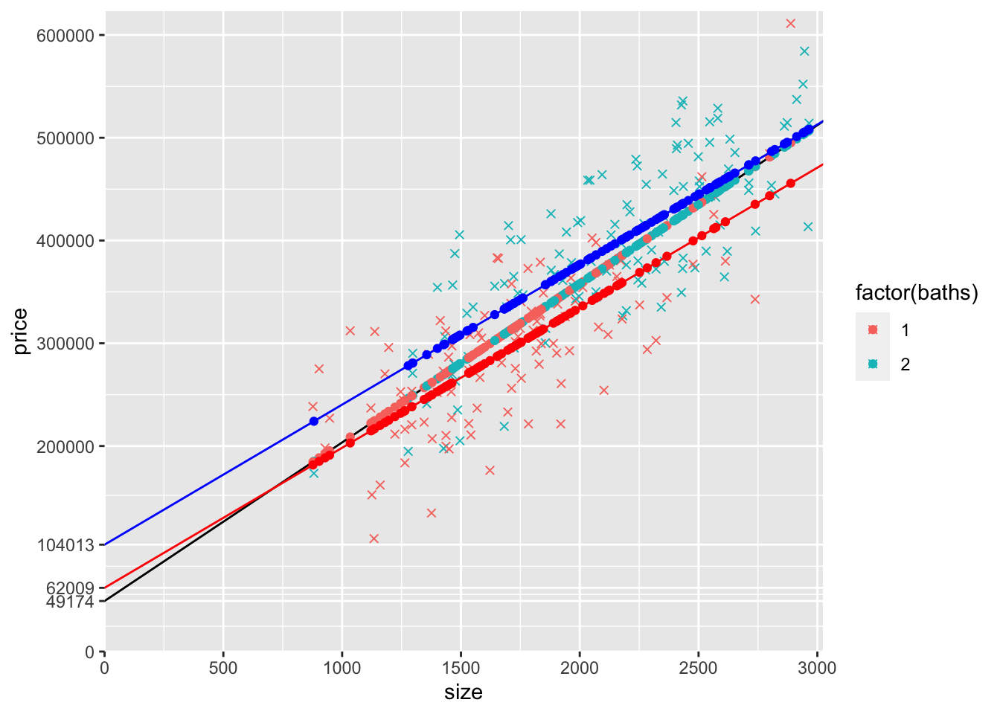
</div>
***


**10)** Using `ifelse()`, create two dummy variables, `baths1` and `baths2`, and add them to `mydata`. The variable `baths1` equals 1 for houses with 1 bathroom and equals 0 otherwise. The variable `baths2` equals 1 for houses with 2 bathroom and equals 0 otherwise. **Make sure to look at the data after creating the variables to make sure you did it correctly (e.g., use `head()`)!**  Calculate the mean of `baths1` and `baths2`. What does the mean of `baths1` tell us? What about the mean of `baths2`? 


<div class="textSoln">
***

```r
mydata$baths1 <- ifelse(mydata$baths == 1, 1, 0)
mydata$baths2 <- ifelse(mydata$baths == 2, 1, 0)
head(mydata,10)
```

```
##     price size beds baths    yHatS   yHatSB  yHatSB1  yHatSB2 baths1 baths2
## 1  427923 2211    3     2 390491.9 405408.3       NA 405408.3      0      1
## 2  270778 1296    2     2 249240.8 280679.1       NA 280679.1      0      1
## 3  329174 1525    2     2 284592.2 311895.4       NA 311895.4      0      1
## 4  537281 2913    4     2 498861.6 501102.2       NA 501102.2      0      1
## 5  275112  903    1     1 188572.3 185102.1 185102.1       NA      1      0
## 6  390832 2302    4     2 404539.8 417813.1       NA 417813.1      0      1
## 7  405488 2132    3     2 378296.5 394639.3       NA 394639.3      0      1
## 8  402451 2052    2     1 365946.6 341729.3 341729.3       NA      1      0
## 9  279597 1471    2     2 276256.1 304534.4       NA 304534.4      0      1
## 10 337245 2252    3     1 396821.2 368992.5 368992.5       NA      1      0
```

```r
mean(mydata$baths1)
```

```
## [1] 0.4722222
```

```r
mean(mydata$baths2)
```

```
## [1] 0.5277778
```

47.2% of the houses from the data have 1 bathroom and 52.8% of the houses are 2 bathrooms.

</div>
***


**11)** Try estimating a regression (with `price` as the y variable) that includes `size`, `baths1`, and `baths2`. Call it `model12`. Display the output using pander, but also display `coef(model12)`. What happens? Why? Hint: which of the 4 MLR assumptions is violated?

<div class="textSoln">
***

```r
model12 <- lm(price~size+baths1+baths2, data = mydata)
pander(summary(model12))
```


-------------------------------------------------------------------
     &nbsp;        Estimate   Std. Error   t value     Pr(>|t|)    
----------------- ---------- ------------ --------- ---------------
 **(Intercept)**    104013      17658       5.89     0.00000001487 

    **size**        136.3       7.944       17.16      5.014e-42   

   **baths1**       -42005       7841      -5.357    0.0000002187  
-------------------------------------------------------------------


--------------------------------------------------------------
 Observations   Residual Std. Error   $R^2$    Adjusted $R^2$ 
-------------- --------------------- -------- ----------------
     216               52094          0.6967       0.6938     
--------------------------------------------------------------

Table: Fitting linear model: price ~ size + baths1 + baths2

The coefficient on `baths2` is `NA` because it cannot include `baths2` in the regression along with `baths1.` It cannot do OLS using both these variables because they are perfectly collinear, violating MLR.3. They are perfectly collinear because `baths1 + baths2 = 1`.
</div>
***


**12)** Since we cannot include both `baths1` and `baths2` in the regression, lets try again without `baths1`. Estimate a model (name it `modeldummy`) that includes `size` and `baths2`, but leave out `baths1`. What is the interpretation of $\betahat{0}$, $\betahat{1}$, and $\betahat{2}$?


<div class="textSoln">
***

```r
modeldummy <- lm(price~size+baths2, data = mydata)
pander(summary(modeldummy))
```


------------------------------------------------------------------
     &nbsp;        Estimate   Std. Error   t value     Pr(>|t|)   
----------------- ---------- ------------ --------- --------------
 **(Intercept)**    62009       14586       4.251     0.00003181  

    **size**        136.3       7.944       17.16     5.014e-42   

   **baths2**       42005        7841       5.357    0.0000002187 
------------------------------------------------------------------


--------------------------------------------------------------
 Observations   Residual Std. Error   $R^2$    Adjusted $R^2$ 
-------------- --------------------- -------- ----------------
     216               52094          0.6967       0.6938     
--------------------------------------------------------------

Table: Fitting linear model: price ~ size + baths2

The intercept (62008.64) is the average house price for a house that is zero square feet in size and that is NOT a 2 bathroom house.

The coefficient on size 136.32 is the expected increase in price for an additional square foot of size, holding constant whether or not the house has two bathrooms.

Holding constant the size of the house, the average price of two bathroom houses is expected to be $42004.73 higher than houses that are not two bathroom houses.

</div>
***


**13)** Create the same graph you created above with the red and blue lines, except modify the `geom_abline()` layers that use coefficients from `modelSB` so that they use `modeldummy` instead. Leave everything else as it is in the previous graph (e.g., leave the black line `geom_abline()` that uses `modelS`, leave the `geom_point()` using `yHatSB1` and `yHatSB2`). The graph itself should look identical (the two models are identical because the only possible values of `baths` are 1 and 2). Make sure that your red line (using `geom_abline()` based on `modeldummy` coefficients) actually goes through the red points (the `geom_point()` based on `yHatSB1`) and make sure that your blue line (using `geom_abline()` based on `modeldummy` coefficients) actually goes through the blue points (the `geom_point()` based on `yHatSB2`).

<div class="textSoln">
***

```r
ggplot(mydata) +
  scale_x_continuous(expand = c(0, 0),
                     limits = c(0, max(mydata$size)*1.02),
                     breaks = seq(0,max(mydata$size)*1.02,500)) + 
  scale_y_continuous(expand = c(0, 0),
                     limits = c(0, max(mydata$price)*1.02), 
                     breaks = yLabels) +  
  geom_point(aes(y=price,x=size,col=factor(baths)),shape=4) +
  geom_abline(intercept = coef(modelS)["(Intercept)"], 
              slope = coef(modelS)["size"],col="black")  + 
  geom_point(data=mydata,aes(y=yHatS,x=size,col=factor(baths))) +
  geom_point(data=mydata,aes(y=yHatSB1,x=size),col="red") +
  geom_point(data=mydata,aes(y=yHatSB2,x=size),col="blue") +
  geom_abline(intercept = coef(modeldummy)["(Intercept)"] 
              + coef(modeldummy)["baths2"]*0, 
              slope = coef(modeldummy)["size"],col="red")  + 
  geom_abline(intercept = coef(modeldummy)["(Intercept)"] 
              + coef(modeldummy)["baths2"]*1, 
              slope = coef(modeldummy)["size"],col="blue")
```


</div>
***


## Slope dummy

**14)** Estimate a model that allows for the slope (with respect to size) to be different for 1 and 2 bathroom houses. Call it `modelSlopeDummy`. Display the results using pander.   Create a graph similar to what you did above, except using this new model. Start with the previous graph and make the following changes: 

1. Remove the black line based on `modelS`. 

2. Remove the `geom_point()` based on `modelS`. 

3. Remove the red `geom_point()` based on `yHatSB1` and replace it with red `geom_point()` based on `modelSlopeDummy` (I suggest creating a `yHatlopeDummy1` similar to how you created `yHatSB1`). 

4. Remove the blue `geom_point()` based on `yHatSB2` and replace it with blue `geom_point()` based on `modelSlopeDummy` (I suggest creating a `yHatlopeDummy2` similar to how you created `yHatSB2`). 

5. Remove the red `geom_abline()` based on `modeldummy` and replace it with a red `geom_abline()` based on `modelSlopeDummy`. 

6. Remove the blue `geom_abline()` based on `modeldummy` and replace it with a red `geom_abline()` based on `modelSlopeDummy`. 

**NOTE: you rarely want to estimate a model with a slope dummy unless you also have the corresponding intercept dummy...see the next question for that model**

<div class="textSoln">
***

```r
# First, create a variable that multiplies size by baths2
mydata$sizeBaths2 <-  mydata$size * mydata$baths2
# Estimate the model using this new variable
modelSlopeDummy <- lm(price~size+sizeBaths2, data = mydata)
pander(summary(modelSlopeDummy))
```


------------------------------------------------------------------
     &nbsp;        Estimate   Std. Error   t value     Pr(>|t|)   
----------------- ---------- ------------ --------- --------------
 **(Intercept)**    82311       15618       5.27     0.0000003332 

    **size**        124.7       9.032       13.81     2.094e-31   

 **sizeBaths2**     21.57       3.984       5.415    0.0000001647 
------------------------------------------------------------------


--------------------------------------------------------------
 Observations   Residual Std. Error   $R^2$    Adjusted $R^2$ 
-------------- --------------------- -------- ----------------
     216               52027          0.6975       0.6946     
--------------------------------------------------------------

Table: Fitting linear model: price ~ size + sizeBaths2


```r
# predicted yHat points for not two bathroom houses
mydata$yHatSlope1 <- ifelse(mydata$baths2 == 0,
                            coef(modelSlopeDummy)["(Intercept)"] 
                            + coef(modelSlopeDummy)["size"]*mydata$size
                            ,NA)

# predicted yHat points for two bathroom houses
mydata$yHatSlope2 <- ifelse(mydata$baths2 == 1,
                            coef(modelSlopeDummy)["(Intercept)"] 
                            + (coef(modelSlopeDummy)["size"] 
                                + coef(modelSlopeDummy)["sizeBaths2"]) *mydata$size
                            ,NA)

## Add new intercepts to yLabels
yLabelsSlope <- sort(unname(c(yLabels, round(coef(modelSlopeDummy)["(Intercept)"],0),round(coef(modelSB)["(Intercept)"] + coef(modelSB)["baths"]*1,0),round(coef(modelSB)["(Intercept)"] + coef(modelSB)["baths"]*2,0))))

ggplot(mydata) +
  scale_x_continuous(expand = c(0, 0),
                     limits = c(0, max(mydata$size)*1.02),
                     breaks = seq(0,max(mydata$size)*1.02,500)) + 
  scale_y_continuous(expand = c(0, 0),
                     limits = c(0, max(mydata$price)*1.02), 
                     breaks = yLabelsSlope) +  
  geom_point(aes(y=price,x=size,col=factor(baths)),shape=4) +
  geom_point(data=mydata,aes(y=yHatSlope1,x=size),col="red") +
  geom_point(data=mydata,aes(y=yHatSlope2,x=size),col="blue") +
  geom_abline(intercept = coef(modelSlopeDummy)["(Intercept)"], 
              slope = coef(modelSlopeDummy)["size"],col="red")  + 
  geom_abline(intercept = coef(modelSlopeDummy)["(Intercept)"],
              slope = coef(modelSlopeDummy)["size"] 
                      + coef(modelSlopeDummy)["sizeBaths2"],col="blue")
```

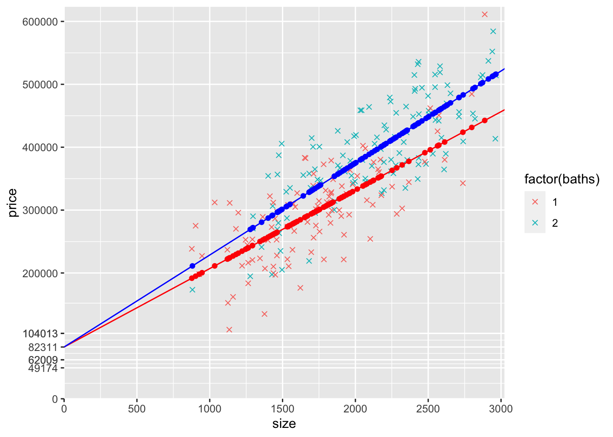
</div>
***


## Intercept and slope dummies


**15)** Estimate a model that allows for both the intercept and the slope (with respect to size) to be different for 1 and 2 bathroom houses. Call it `modelSlopeAndInterceptDummies`.  Create a graph of this model by following the same steps you followed above to create the graph of the slope dummy model.


<div class="textSoln">
***

```r
# Estimate the model
modelSlopeAndInterceptDummies <- lm(price~baths2+size+sizeBaths2, data = mydata)
pander(summary(modelSlopeAndInterceptDummies))
```


---------------------------------------------------------------
     &nbsp;        Estimate   Std. Error   t value   Pr(>|t|)  
----------------- ---------- ------------ --------- -----------
 **(Intercept)**    75489       21120       3.574    0.0004349 

   **baths2**       15120       31443      0.4809     0.6311   

    **size**        128.5       11.92       10.77    7.231e-22 

 **sizeBaths2**     14.12         16       0.8829     0.3783   
---------------------------------------------------------------


--------------------------------------------------------------
 Observations   Residual Std. Error   $R^2$    Adjusted $R^2$ 
-------------- --------------------- -------- ----------------
     216               52121          0.6978       0.6935     
--------------------------------------------------------------

Table: Fitting linear model: price ~ baths2 + size + sizeBaths2


```r
# predicted yHat points for not two bathroom houses
mydata$yHatSlopeAndIntercept1 <- ifelse(mydata$baths2 == 0,
                            coef(modelSlopeAndInterceptDummies)["(Intercept)"] 
                            + coef(modelSlopeAndInterceptDummies)["size"]*mydata$size
                            ,NA)

# predicted yHat points for two bathroom houses
mydata$yHatSlopeAndIntercept2 <- ifelse(mydata$baths2 == 1,
                            coef(modelSlopeAndInterceptDummies)["(Intercept)"] 
                            + coef(modelSlopeAndInterceptDummies)["baths2"] 
                            + (coef(modelSlopeAndInterceptDummies)["size"] 
                                + coef(modelSlopeAndInterceptDummies)["sizeBaths2"]) 
                              *mydata$size
                            ,NA)

# Add new y intercepts to y axis labels
yLabelsSlopeIntercept <- sort(unname(c(yLabelsSlope,round(coef(modelSlopeAndInterceptDummies)["(Intercept)"],0),round(coef(modelSlopeAndInterceptDummies)["(Intercept)"]+coef(modelSlopeAndInterceptDummies)["baths2"],0))))


ggplot(mydata) +
  scale_x_continuous(expand = c(0, 0),
                     limits = c(0, max(mydata$size)*1.02),
                     breaks = seq(0,max(mydata$size)*1.02,500)) + 
  scale_y_continuous(expand = c(0, 0),
                     limits = c(0, max(mydata$price)*1.02), 
                     breaks = yLabelsSlopeIntercept) +  
  geom_point(aes(y=price,x=size,col=factor(baths)),shape=4) +
  # geom_abline(intercept = coef(modelS)["(Intercept)"], 
              # slope = coef(modelS)["size"],col="black")  + 
  # geom_point(data=mydata,aes(y=yHatS,x=size,col=factor(baths))) +
  geom_point(data=mydata,aes(y=yHatSlopeAndIntercept1,x=size),col="red") +
  geom_point(data=mydata,aes(y=yHatSlopeAndIntercept2,x=size),col="blue") +
  geom_abline(intercept = coef(modelSlopeAndInterceptDummies)["(Intercept)"], 
              slope = coef(modelSlopeAndInterceptDummies)["size"],col="red")  + 
  geom_abline(intercept = coef(modelSlopeAndInterceptDummies)["(Intercept)"]
                        + coef(modelSlopeAndInterceptDummies)["baths2"],
              slope = coef(modelSlopeAndInterceptDummies)["size"] 
                      + coef(modelSlopeAndInterceptDummies)["sizeBaths2"],col="blue")
```

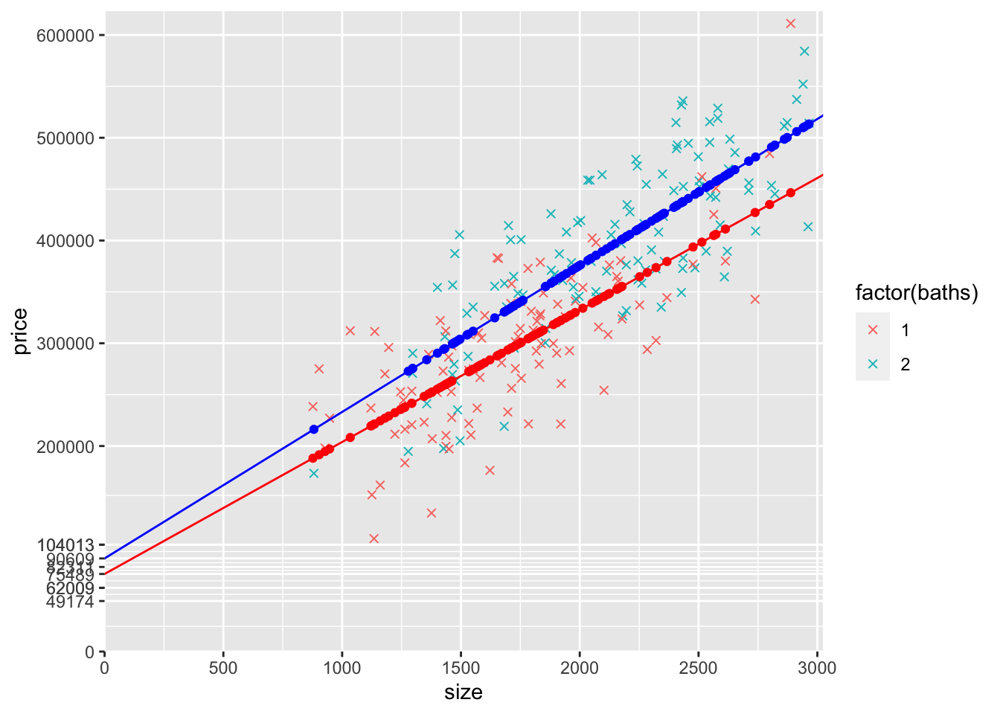

</div>
***


**16)** Compare the four models (`modelS`, `modeldummy`, `modelSlopeDummy`, and `modelSlopeAndInterceptDummies`). Display them all side-by-side using stargazer. Then write out the conditional expectations for all four models for one bathroom houses and two bathroom houses. 


<div class="textSoln">
***

```r
stargazer(modelS,modeldummy,modelSlopeDummy,modelSlopeAndInterceptDummies, 
          type = "html", 
          report=('vc*p'),
          keep.stat = c("n","rsq","adj.rsq"), 
          notes = "<em>&#42;p&lt;0.1;&#42;&#42;p&lt;0.05;&#42;&#42;&#42;p&lt;0.01</em>", 
          notes.append = FALSE)
```


<table style="text-align:center"><tr><td colspan="5" style="border-bottom: 1px solid black"></td></tr><tr><td style="text-align:left"></td><td colspan="4"><em>Dependent variable:</em></td></tr>
<tr><td></td><td colspan="4" style="border-bottom: 1px solid black"></td></tr>
<tr><td style="text-align:left"></td><td colspan="4">price</td></tr>
<tr><td style="text-align:left"></td><td>(1)</td><td>(2)</td><td>(3)</td><td>(4)</td></tr>
<tr><td colspan="5" style="border-bottom: 1px solid black"></td></tr><tr><td style="text-align:left">size</td><td>154.373<sup>***</sup></td><td>136.316<sup>***</sup></td><td>124.733<sup>***</sup></td><td>128.467<sup>***</sup></td></tr>
<tr><td style="text-align:left"></td><td>p = 0.000</td><td>p = 0.000</td><td>p = 0.000</td><td>p = 0.000</td></tr>
<tr><td style="text-align:left"></td><td></td><td></td><td></td><td></td></tr>
<tr><td style="text-align:left">baths2</td><td></td><td>42,004.730<sup>***</sup></td><td></td><td>15,120.010</td></tr>
<tr><td style="text-align:left"></td><td></td><td>p = 0.00000</td><td></td><td>p = 0.632</td></tr>
<tr><td style="text-align:left"></td><td></td><td></td><td></td><td></td></tr>
<tr><td style="text-align:left">sizeBaths2</td><td></td><td></td><td>21.572<sup>***</sup></td><td>14.123</td></tr>
<tr><td style="text-align:left"></td><td></td><td></td><td>p = 0.00000</td><td>p = 0.379</td></tr>
<tr><td style="text-align:left"></td><td></td><td></td><td></td><td></td></tr>
<tr><td style="text-align:left">Constant</td><td>49,173.680<sup>***</sup></td><td>62,008.640<sup>***</sup></td><td>82,310.930<sup>***</sup></td><td>75,489.050<sup>***</sup></td></tr>
<tr><td style="text-align:left"></td><td>p = 0.002</td><td>p = 0.00004</td><td>p = 0.00000</td><td>p = 0.0005</td></tr>
<tr><td style="text-align:left"></td><td></td><td></td><td></td><td></td></tr>
<tr><td colspan="5" style="border-bottom: 1px solid black"></td></tr><tr><td style="text-align:left">Observations</td><td>216</td><td>216</td><td>216</td><td>216</td></tr>
<tr><td style="text-align:left">R<sup>2</sup></td><td>0.656</td><td>0.697</td><td>0.697</td><td>0.698</td></tr>
<tr><td style="text-align:left">Adjusted R<sup>2</sup></td><td>0.654</td><td>0.694</td><td>0.695</td><td>0.694</td></tr>
<tr><td colspan="5" style="border-bottom: 1px solid black"></td></tr><tr><td style="text-align:left"><em>Note:</em></td><td colspan="4" style="text-align:right"><em>&#42;p&lt;0.1;&#42;&#42;p&lt;0.05;&#42;&#42;&#42;p&lt;0.01</em></td></tr>
</table>


Here are the expected prices for 1 bathroom (not-two bathroom) houses
$$
\begin{aligned}
E(price|size,baths2=0) &= 49174 + 154⋅size
\\ E(price|size,baths2=0) &= 62009+136⋅size
\\ E(price|size,baths2=0) &= 82311+125⋅size
\\ E(price|size,baths2=0) &= 75489+128⋅size
\end{aligned}
$$

Here are the expected prices for two bathroom houses
$$
\begin{aligned}
E(price|size,baths2=1) &= 49174+154⋅size
\\ E(price|size,baths2=1) &= 104013+136⋅size
\\ E(price|size,baths2=1) &= 82311+146⋅size
\\ E(price|size,baths2=1) &= 90609+143⋅size
\end{aligned}
$$


</div>
***


**17)** What do you notice about the intercepts and the slopes? Think about what variation each model allows and what restrictions it imposes. Why are the intercepts furthest out for the model with the intercept dummy (`modeldummy`), at one point in the middle for the model with the slope dummy, and in between for the model with both the intercept and slope dummies? How does that relate to the estimated slopes? How does that relate to the model that only includes size?  I'd start by comparing the graphs of the models. 


<div class="textSoln">
***

```r
yLabelsCombined <- sort(c(0,unname(c(round(coef(modelS)[1],0),round(coef(modeldummy)["(Intercept)"] 
              + coef(modeldummy)["baths2"]*0,0),round(coef(modeldummy)["(Intercept)"] 
              + coef(modeldummy)["baths2"]*1,0),round(coef(modelSlopeDummy)["(Intercept)"],0),round(coef(modelSlopeAndInterceptDummies)["(Intercept)"] 
              + coef(modelSlopeAndInterceptDummies)["baths2"]*0,0),round(coef(modelSlopeAndInterceptDummies)["(Intercept)"] 
              + coef(modelSlopeAndInterceptDummies)["baths2"]*1,0))),seq(200000,600000,100000)))

 ggplot(mydata) +
  scale_x_continuous(expand = c(0, 0),
                     limits = c(0, max(mydata$size)*1.02),
                     breaks = seq(0,max(mydata$size)*1.02,500)) + 
  scale_y_continuous(expand = c(0, 0),
                     limits = c(0, max(mydata$price)*1.02), 
                     breaks = yLabelsCombined) +  
  geom_point(aes(y=price,x=size,col=factor(baths)),shape=4) +
  geom_abline(intercept = coef(modelS)["(Intercept)"],
              slope = coef(modelS)["size"],col="black")  +
  geom_abline(intercept = coef(modeldummy)["(Intercept)"] 
              + coef(modeldummy)["baths2"]*0, 
              slope = coef(modeldummy)["size"],col="red")  + 
  geom_abline(intercept = coef(modeldummy)["(Intercept)"] 
              + coef(modeldummy)["baths2"]*1, 
              slope = coef(modeldummy)["size"],col="red") + 
  geom_abline(intercept = coef(modelSlopeDummy)["(Intercept)"], 
              slope = coef(modelSlopeDummy)["size"],col="blue")  + 
  geom_abline(intercept = coef(modelSlopeDummy)["(Intercept)"],
              slope = coef(modelSlopeDummy)["size"] 
                      + coef(modelSlopeDummy)["sizeBaths2"],col="blue",show.legend = TRUE)  + 
  geom_abline(intercept = coef(modelSlopeAndInterceptDummies)["(Intercept)"], 
              slope = coef(modelSlopeAndInterceptDummies)["size"],col="purple")  + 
  geom_abline(intercept = coef(modelSlopeAndInterceptDummies)["(Intercept)"]
                        + coef(modelSlopeAndInterceptDummies)["baths2"],
              slope = coef(modelSlopeAndInterceptDummies)["size"] 
                      + coef(modelSlopeAndInterceptDummies)["sizeBaths2"],col="purple",show.legend = TRUE) +
  labs(title="Lines from All 4 Models", color = "baths")
```

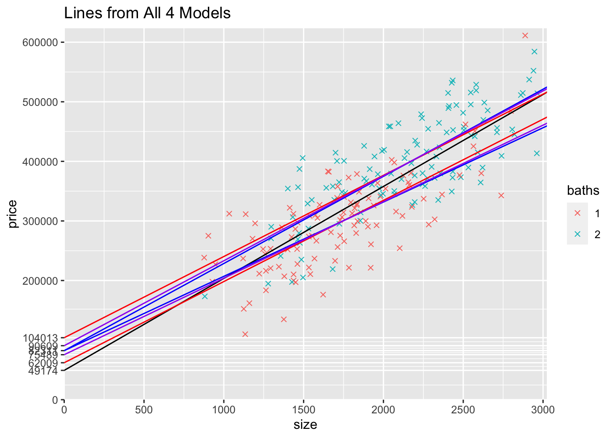

The black line is from the first model that only includes size. 

The red lines are the model that includes `baths2` as an intercept dummy only. These red lines are the most spread out because bathrooms is only accounted for by different intercepts. 

The blue lines are from the model that only allows the slope to differ. Forcing the intercept to be the same exaggerates the two slopes (think of taking the red lines and pulling the intercepts together…to still fit thought the data, the one bathroom line gets flatter and the two bathroom line gets steeper). 

Finally, the purple lines are for the model that allows both the intercept and slope to depend on if the house has 2 bathrooms. These intercepts lie between the other extremes, the model that only reflects bathrooms in the intercepts and the model that only reflects bathrooms in the slopes.

</div>
***


## Models with the number of bedrooms

**18)** To help you gain additional intuition for what's going on in linear regressions, try estimating a model that includes size and the number of bedrooms (`beds`).  Try making a plot that includes `yHat` predicted values. Try coloring the `yHat` points based on the number of bedrooms. Why are the `yHat` points arranged in rows? How many rows are there? Why? Can you add `geom_abline()`s that connect the rows of dots? 


<div class="textSoln">
***

```r
mydata %>% count(beds)
```

```
##   beds  n
## 1    1 32
## 2    2 66
## 3    3 68
## 4    4 50
```

```r
modelBeds <- lm(data=mydata,price~size+beds)
pander(summary(modelBeds))
```


--------------------------------------------------------------------
     &nbsp;        Estimate   Std. Error   t value      Pr(>|t|)    
----------------- ---------- ------------ --------- ----------------
 **(Intercept)**    69942       17390       4.022      0.00008013   

    **size**        113.8        18.4       6.184    0.000000003146 

    **beds**        22009        9103       2.418       0.01645     
--------------------------------------------------------------------


-------------------------------------------------------------
 Observations   Residual Std. Error   $R^2$   Adjusted $R^2$ 
-------------- --------------------- ------- ----------------
     216               54747          0.665       0.6619     
-------------------------------------------------------------

Table: Fitting linear model: price ~ size + beds

```r
## Calculate "yHat" predicted points using fitted() function
mydata$yHatBeds <- fitted(modelBeds)

yLabelsBeds <- c(0,unname(c(round(coef(modelBeds)["(Intercept)"] + coef(modelBeds)["beds"]*1,0),round(coef(modelBeds)["(Intercept)"] + coef(modelBeds)["beds"]*2,0),round(coef(modelBeds)["(Intercept)"] + coef(modelBeds)["beds"]*3,0),round(coef(modelBeds)["(Intercept)"] + coef(modelBeds)["beds"]*4,0))),seq(200000,600000,100000))


 ggplot(mydata) +
  scale_x_continuous(expand = c(0, 0),
                     limits = c(0, max(mydata$size)*1.02),
                     breaks = seq(0,max(mydata$size)*1.02,500)) + 
  scale_y_continuous(expand = c(0, 0),
                     limits = c(0, max(mydata$price)*1.02), breaks=yLabelsBeds) +  
  geom_point(aes(y=price,x=size,col=factor(beds)),shape=4) +
  geom_abline(intercept = coef(modelBeds)["(Intercept)"] + coef(modelBeds)["beds"]*1,
              slope = coef(modelBeds)["size"],col="red")  +
  geom_abline(intercept = coef(modelBeds)["(Intercept)"] + coef(modelBeds)["beds"]*2,
              slope = coef(modelBeds)["size"],col="orange")  +
  geom_abline(intercept = coef(modelBeds)["(Intercept)"] + coef(modelBeds)["beds"]*3,
              slope = coef(modelBeds)["size"],col="green")  +
  geom_abline(intercept = coef(modelBeds)["(Intercept)"] + coef(modelBeds)["beds"]*4,
              slope = coef(modelBeds)["size"],col="blue")  +
  geom_point(aes(y=yHatBeds,x=size,col=factor(beds))) + scale_color_manual(values=c("red", "orange", "green","blue"))
```

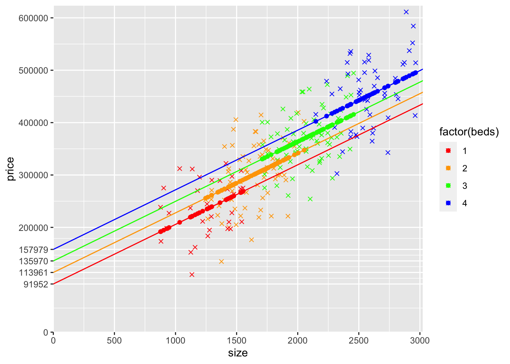

The houses have either 1, 2, 3, or 4 bedrooms so the `yHat` points should be arranged in 4 rows.
</div>
***


**19)**  Now try changing the previous model to include `factor(beds)` instead of `beds` (alternatively, create a dummy variable for 2 bedroom houses, 3 bedroom houses, and 4 bedroom houses, and include these three dummy variables in the model). Try making a plot that includes `yHat` predicted values. Try coloring the `yHat` points based on the number of bedrooms. Why are the `yHat` points arranged in rows? How many rows are there? Why? Can you add `geom_abline()`s that connect the rows of dots? How doe the rows of dots (and the `geom_abline()`s that connect them) compare with the previous model? 


<div class="textSoln">
***

```r
modelBedsDummies <- lm(data=mydata,price~size+factor(beds))
pander(summary(modelBedsDummies))
```


---------------------------------------------------------------------
      &nbsp;         Estimate   Std. Error   t value     Pr(>|t|)    
------------------- ---------- ------------ --------- ---------------
  **(Intercept)**     98518       25537       3.858      0.000152    

     **size**         111.7       18.75       5.956    0.00000001066 

 **factor(beds)2**    17174       13691       1.254       0.2111     

 **factor(beds)3**    39851       19369       2.057       0.04087    

 **factor(beds)4**    67649       27898       2.425       0.01616    
---------------------------------------------------------------------


--------------------------------------------------------------
 Observations   Residual Std. Error   $R^2$    Adjusted $R^2$ 
-------------- --------------------- -------- ----------------
     216               54947          0.6657       0.6594     
--------------------------------------------------------------

Table: Fitting linear model: price ~ size + factor(beds)

```r
## Calculate "yHat" predicted points using fitted() function
mydata$yHatBedsDummies <- fitted(modelBedsDummies)

yLabelsBedsDummies <- c(0,unname(c(round(coef(modelBedsDummies)["(Intercept)"],0),round(coef(modelBedsDummies)["(Intercept)"] + coef(modelBedsDummies)["factor(beds)2"],0),round(coef(modelBedsDummies)["(Intercept)"] + coef(modelBedsDummies)["factor(beds)3"],0),round(coef(modelBedsDummies)["(Intercept)"] + coef(modelBedsDummies)["factor(beds)4"],0))),seq(200000,600000,100000))

ggplot(mydata) +
  scale_x_continuous(expand = c(0, 0),
                     limits = c(0, max(mydata$size)*1.02),
                     breaks = seq(0,max(mydata$size)*1.02,500)) + 
  scale_y_continuous(expand = c(0, 0),
                     limits = c(0, max(mydata$price)*1.02), breaks = yLabelsBedsDummies) +  
  geom_point(aes(y=price,x=size,col=factor(beds)),shape=4) +
  geom_abline(intercept = coef(modelBedsDummies)["(Intercept)"],
              slope = coef(modelBedsDummies)["size"],col="red")  +
  geom_abline(intercept = coef(modelBedsDummies)["(Intercept)"] + coef(modelBedsDummies)["factor(beds)2"],
              slope = coef(modelBedsDummies)["size"],col="orange")  +
  geom_abline(intercept = coef(modelBedsDummies)["(Intercept)"] + coef(modelBedsDummies)["factor(beds)3"],
              slope = coef(modelBedsDummies)["size"],col="green")  +
  geom_abline(intercept = coef(modelBedsDummies)["(Intercept)"] + coef(modelBedsDummies)["factor(beds)4"],
              slope = coef(modelBedsDummies)["size"],col="blue")  +
  geom_point(aes(y=yHatBedsDummies,x=size,col=factor(beds))) + scale_color_manual(values=c("red", "orange", "green","blue"))
```

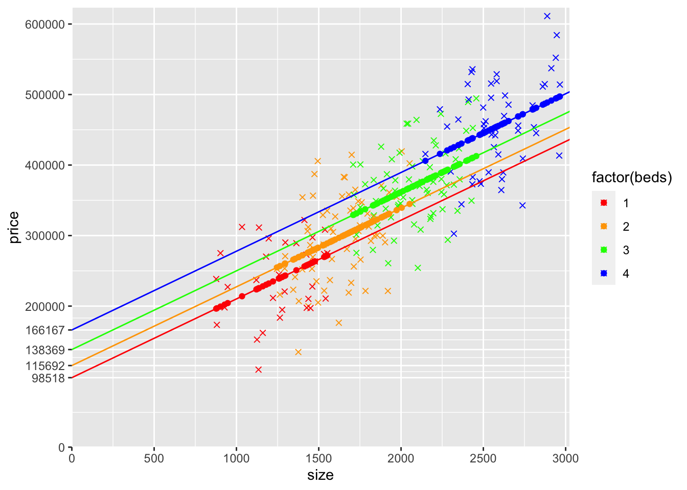

The difference in predicted price for the different number of bedrooms in the last model is the same, meaning the gap between each colored line is the same. In the first model that includes beds, the coefficient on beds is 22009.1, so that is the vertical gap between each of the 4 lines.

In this model, the gap can be different. Looking at the graph, it looks like the jump from 1 to 2 is smaller than for 2 to 3, and smaller still than for 3 to 4.

In the model that includes 2-bedroom, 3-bedroom, and 4-bedroom as dummy variables, the gaps are different. Going from 1 to 2 bedrooms is an increase of 17174.45. 

Going from 2 to 3 bedrooms is an increase of 22676.43 (the coefficient on the 3 bedroom dummy variable minus the coefficient on the 2 bedroom dummy variable). 

Going from 3 to 4 bedrooms is an increase of 27798.32 (the coefficient on the 4-bedroom dummy variable minus the coefficient on the 3-bedroom dummy variable).

</div>
***


**20)** Now let's look at models with the number of bathrooms in addition to size and the number of bedrooms. For this model, include bedrooms as `beds`. Try to answer the same questions as the first model with bedrooms. Try making a plot that includes `yHat` predicted values. Try coloring the `yHat` points based on the number of bedrooms. Why are the `yHat` points arranged in rows? How many rows are there? Why? Can you add `geom_abline()`s that connect the rows of dots? 


<div class="textSoln">
***

```r
modelBedsAndBaths <- lm(data=mydata,price~size+beds+baths)
pander(summary(modelBedsAndBaths))
```


-------------------------------------------------------------------
     &nbsp;        Estimate   Std. Error   t value     Pr(>|t|)    
----------------- ---------- ------------ --------- ---------------
 **(Intercept)**    38729       17445       2.22        0.02747    

    **size**        101.8        17.5       5.815    0.00000002211 

    **beds**        19000        8603       2.209       0.02828    

    **baths**       40858        7788       5.246    0.0000003751  
-------------------------------------------------------------------


--------------------------------------------------------------
 Observations   Residual Std. Error   $R^2$    Adjusted $R^2$ 
-------------- --------------------- -------- ----------------
     216               51626          0.7035       0.6993     
--------------------------------------------------------------

Table: Fitting linear model: price ~ size + beds + baths

```r
## Calculate "yHat" predicted points using fitted() function
mydata$yHatBedsAndBaths <- fitted(modelBedsAndBaths)

 ggplot(mydata) +
  scale_x_continuous(expand = c(0, 0),
                     limits = c(0, max(mydata$size)*1.02),
                     breaks = seq(0,max(mydata$size)*1.02,500)) + 
  scale_y_continuous(expand = c(0, 0),
                     limits = c(0, max(mydata$price)*1.02)) +  
  geom_point(aes(y=price,x=size,col=factor(beds)),shape=4) +
  geom_abline(intercept = coef(modelBedsAndBaths)["(Intercept)"] 
              + coef(modelBedsAndBaths)["beds"]*1 
              + coef(modelBedsAndBaths)["baths"]*1,
              slope = coef(modelBedsAndBaths)["size"],col="red")  +
  geom_abline(intercept = coef(modelBedsAndBaths)["(Intercept)"] 
              + coef(modelBedsAndBaths)["beds"]*1 
              + coef(modelBedsAndBaths)["baths"]*2,
              slope = coef(modelBedsAndBaths)["size"],col="red")  +
  geom_abline(intercept = coef(modelBedsAndBaths)["(Intercept)"] 
              + coef(modelBedsAndBaths)["beds"]*2
              + coef(modelBedsAndBaths)["baths"]*1,
              slope = coef(modelBedsAndBaths)["size"],col="orange")  +
  geom_abline(intercept = coef(modelBedsAndBaths)["(Intercept)"] 
              + coef(modelBedsAndBaths)["beds"]*2
              + coef(modelBedsAndBaths)["baths"]*2,
              slope = coef(modelBedsAndBaths)["size"],col="orange")  +
  geom_abline(intercept = coef(modelBedsAndBaths)["(Intercept)"] 
              + coef(modelBedsAndBaths)["beds"]*3
              + coef(modelBedsAndBaths)["baths"]*1,
              slope = coef(modelBedsAndBaths)["size"],col="green")  +
  geom_abline(intercept = coef(modelBedsAndBaths)["(Intercept)"] 
              + coef(modelBedsAndBaths)["beds"]*3
              + coef(modelBedsAndBaths)["baths"]*2,
              slope = coef(modelBedsAndBaths)["size"],col="green")  +
  geom_abline(intercept = coef(modelBedsAndBaths)["(Intercept)"] 
              + coef(modelBedsAndBaths)["beds"]*4
              + coef(modelBedsAndBaths)["baths"]*1,
              slope = coef(modelBedsAndBaths)["size"],col="blue")  +
  geom_abline(intercept = coef(modelBedsAndBaths)["(Intercept)"] 
              + coef(modelBedsAndBaths)["beds"]*4
              + coef(modelBedsAndBaths)["baths"]*2,
              slope = coef(modelBedsAndBaths)["size"],col="blue")  +
  geom_point(aes(y=yHatBedsAndBaths,x=size,col=factor(beds))) + scale_color_manual(values=c("red", "orange", "green","blue"))
```

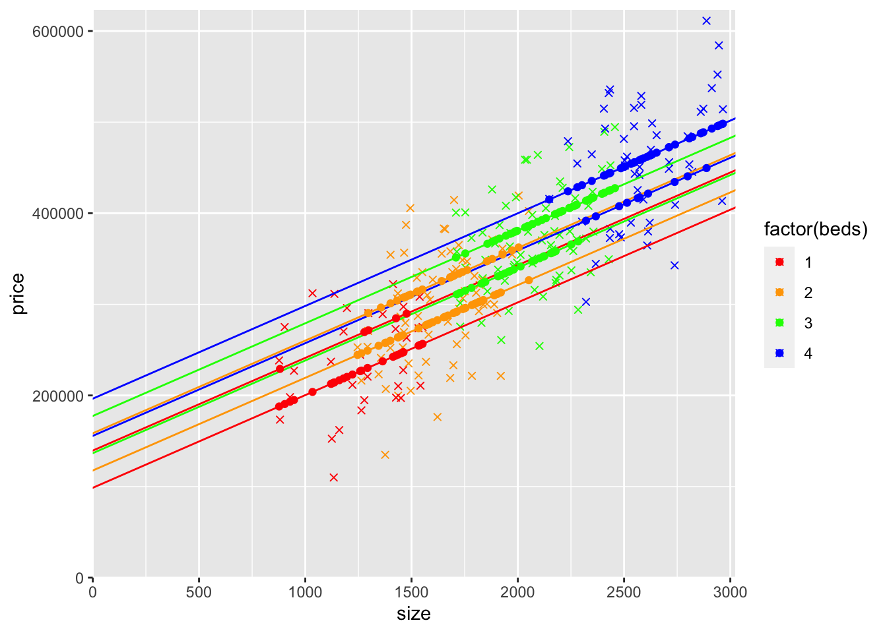

There would be 8 combinations corresponding to 4 types of bedrooms with either 1 or 2 bathrooms which resulting in 8 rows of `yHat` points.

For each value of the number of bedrooms, the gap between the lower and upper `yHat` rows is the coefficient on baths (i.e., the vertical gap is the value of having 2 bathrooms instead of 1).

</div>
***


**21)** Finally, try adding `baths` to the model with `factor(beds)`. If you understood the previous two questions, you should have no problem understanding this question too. If you didn't, make sure you understand those models first before trying to wrap your head around this one. 


<div class="textSoln">
***

```r
modelBedsDummiesAndBaths <- lm(data=mydata,price~size+factor(beds)+baths)
pander(summary(modelBedsDummiesAndBaths))
```


--------------------------------------------------------------------
      &nbsp;         Estimate   Std. Error   t value     Pr(>|t|)   
------------------- ---------- ------------ --------- --------------
  **(Intercept)**     67253       24763       2.716      0.00716    

     **size**         98.51       17.83       5.526    0.0000000964 

 **factor(beds)2**    10914       12946      0.8431       0.4001    

 **factor(beds)3**    32158       18296       1.758      0.08026    

 **factor(beds)4**    58536       26326       2.224      0.02725    

     **baths**        41370        7822       5.289    0.0000003082 
--------------------------------------------------------------------


-------------------------------------------------------------
 Observations   Residual Std. Error   $R^2$   Adjusted $R^2$ 
-------------- --------------------- ------- ----------------
     216               51740          0.705       0.698      
-------------------------------------------------------------

Table: Fitting linear model: price ~ size + factor(beds) + baths

```r
## Calculate "yHat" predicted points using fitted() function
mydata$yHatBedsDummiesAndBaths <- fitted(modelBedsDummiesAndBaths)

ggplot(mydata) +
  scale_x_continuous(expand = c(0, 0),
                     limits = c(0, max(mydata$size)*1.02),
                     breaks = seq(0,max(mydata$size)*1.02,500)) + 
  scale_y_continuous(expand = c(0, 0),
                     limits = c(0, max(mydata$price)*1.02)) +  
  geom_point(aes(y=price,x=size,col=factor(beds)),shape=4) +
  geom_abline(intercept = coef(modelBedsDummiesAndBaths)["(Intercept)"] 
              + coef(modelBedsDummiesAndBaths)["baths"]*1,
              slope = coef(modelBedsDummiesAndBaths)["size"],col="red")  +
  geom_abline(intercept = coef(modelBedsDummiesAndBaths)["(Intercept)"] 
              + coef(modelBedsDummiesAndBaths)["baths"]*2,
              slope = coef(modelBedsDummiesAndBaths)["size"],col="red")  +
  geom_abline(intercept = coef(modelBedsDummiesAndBaths)["(Intercept)"] 
              + coef(modelBedsDummiesAndBaths)["factor(beds)2"]
              + coef(modelBedsDummiesAndBaths)["baths"]*1,
              slope = coef(modelBedsDummiesAndBaths)["size"],col="orange")  +
  geom_abline(intercept = coef(modelBedsDummiesAndBaths)["(Intercept)"] 
              + coef(modelBedsDummiesAndBaths)["factor(beds)2"]
              + coef(modelBedsDummiesAndBaths)["baths"]*2,
              slope = coef(modelBedsDummiesAndBaths)["size"],col="orange")  +
  geom_abline(intercept = coef(modelBedsDummiesAndBaths)["(Intercept)"] 
              + coef(modelBedsDummiesAndBaths)["factor(beds)3"]
              + coef(modelBedsDummiesAndBaths)["baths"]*1,
              slope = coef(modelBedsDummiesAndBaths)["size"],col="green")  +
  geom_abline(intercept = coef(modelBedsDummiesAndBaths)["(Intercept)"] 
              + coef(modelBedsDummiesAndBaths)["factor(beds)3"]
              + coef(modelBedsDummiesAndBaths)["baths"]*2,
              slope = coef(modelBedsDummiesAndBaths)["size"],col="green")  +
  geom_abline(intercept = coef(modelBedsDummiesAndBaths)["(Intercept)"] 
              + coef(modelBedsDummiesAndBaths)["factor(beds)4"]
              + coef(modelBedsDummiesAndBaths)["baths"]*1,
              slope = coef(modelBedsDummiesAndBaths)["size"],col="blue")  +
  geom_abline(intercept = coef(modelBedsDummiesAndBaths)["(Intercept)"] 
              + coef(modelBedsDummiesAndBaths)["factor(beds)4"]
              + coef(modelBedsDummiesAndBaths)["baths"]*2,
              slope = coef(modelBedsDummiesAndBaths)["size"],col="blue")  +
  geom_point(aes(y=yHatBedsDummiesAndBaths,x=size,col=factor(beds))) + scale_color_manual(values=c("red", "orange", "green","blue"))
```

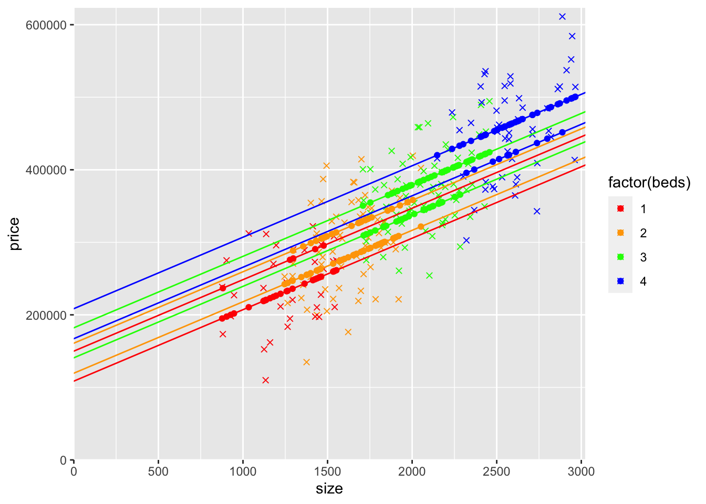

This model is just like the previous one, except the increase for each consecutive number of bedrooms isn’t the same because 2-bedroom, 3-bedroom, and 4-bedroom are included as dummy variables.

</div>
***
